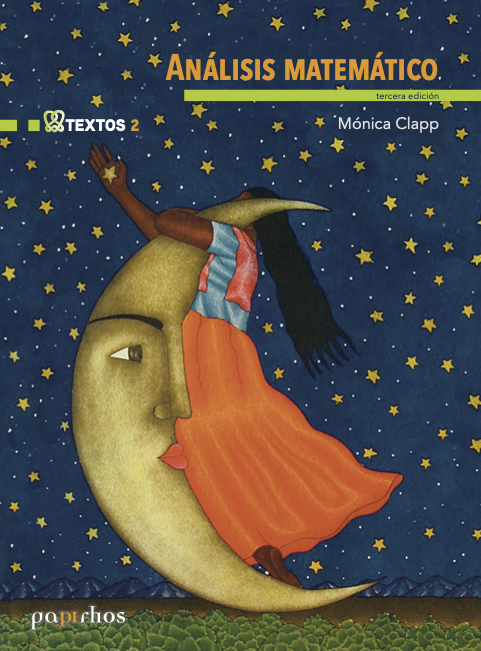
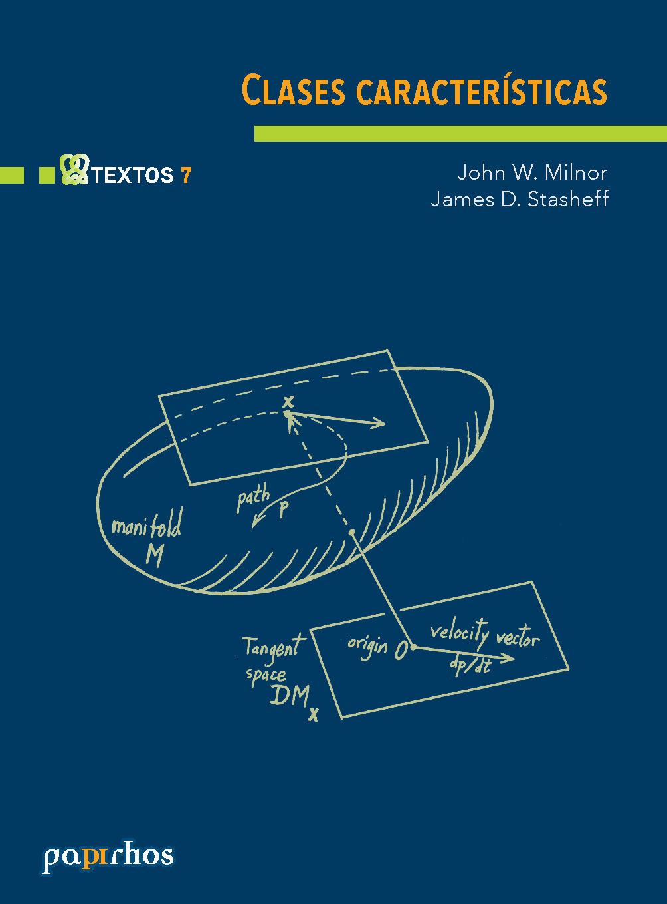
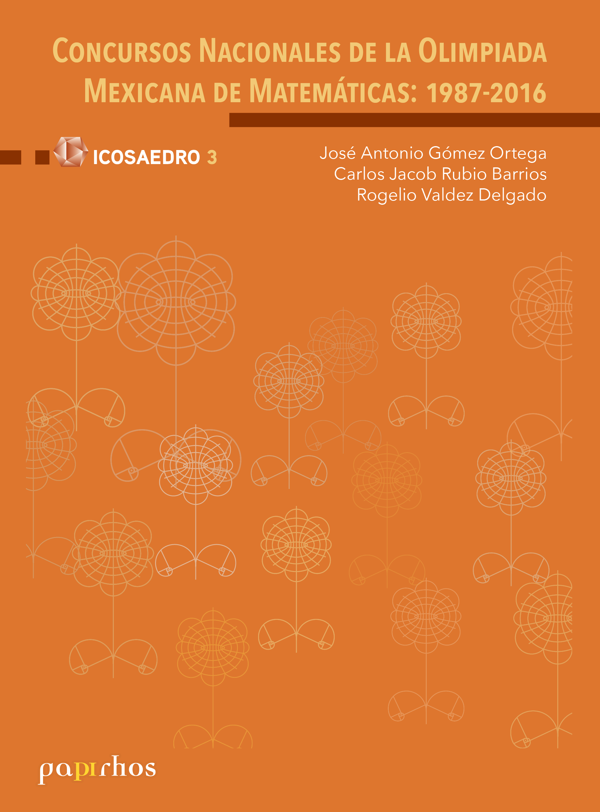
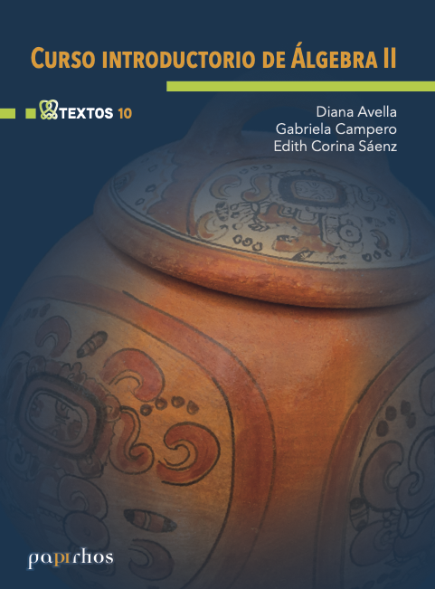
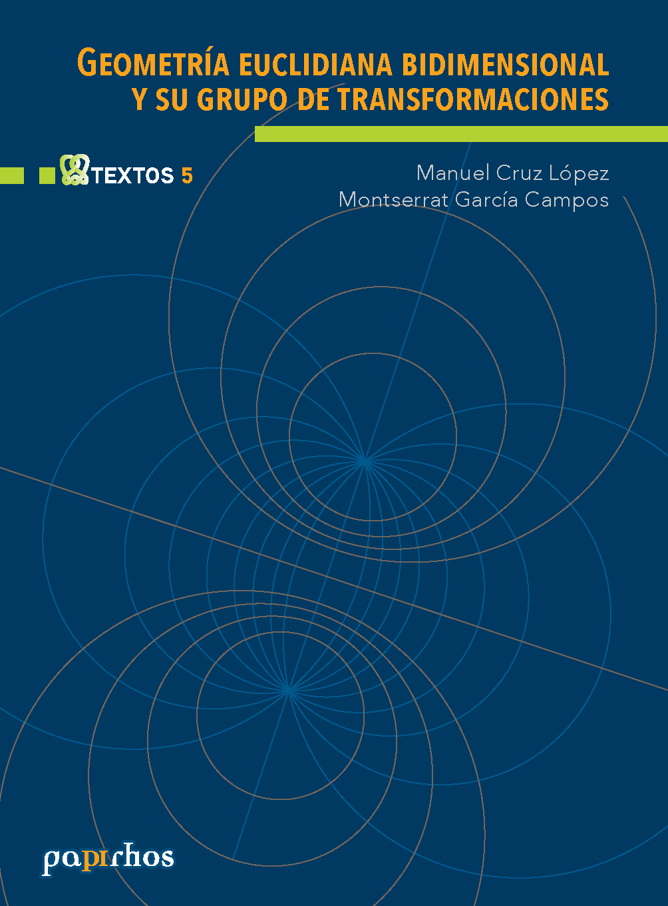
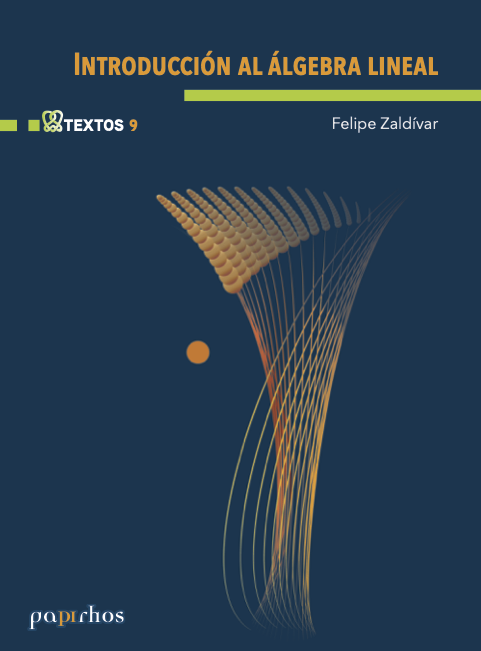
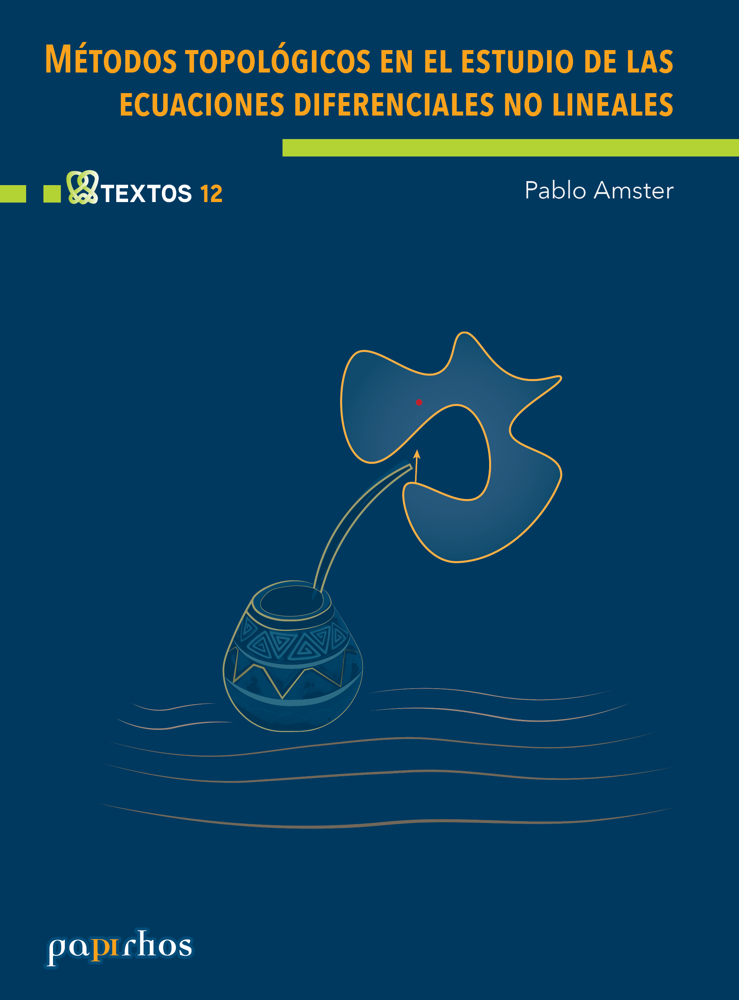
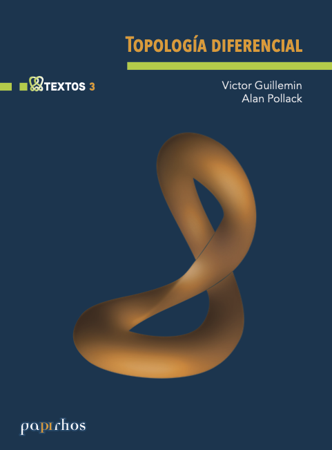

<section class="catalogo-hero">

Colecciones

<h1>Explora por colección</h1>

Consulta los títulos disponibles de Papirhos Digital organizados por colección. Cada sección reúne libros con sus fichas bibliográficas, metadatos de edición, reimpresiones registradas y archivos disponibles.

<a class="catalogo-hero-chip" href="#cuadernos-de-olimpiadas-de-matematicas">
<strong>Cuadernos de olimpiadas de matemáticas</strong>
1 título
</a>
<a class="catalogo-hero-chip" href="#papirhos">
<strong>Papirhos</strong>
17 títulos
</a>

</section>

<section class="catalogo-seccion" id="cuadernos-de-olimpiadas-de-matematicas">
<h2>Cuadernos de olimpiadas de matemáticas</h2>

<a class="catalogo-libro" href="../libros/cuad-x-1/">

<h3>Combinatoria</h3>

Maria Luisa Pérez Seguí

Disponible en línea

</a>

</section>

<section class="catalogo-seccion" id="papirhos">
<h2>Papirhos</h2>

<a class="catalogo-libro" href="../libros/pap-tex-2/">

<h3>Análisis Matemático</h3>

Mónica Clapp

Textos

Disponible en formato físico

</a>
<a class="catalogo-libro" href="../libros/pap-tex-7/">

<h3>Clases características</h3>

John Milnor, James Stasheff

Textos

Disponible en formato físico

</a>
<a class="catalogo-libro" href="../libros/pap-ico-3/">

<h3>Concursos Nacionales de la Olimpiada Mexicana de Matemáticas:1987-2016</h3>

Jose Antonio Gómez Ortega, Carlos Jacob Rubio Barrios, Rogelio Valdez Delgado

Icosaedro

Disponible en formato físico

</a>
<a class="catalogo-libro" href="../libros/pap-tex-11/">

<h3>Curso breve de geometría proyectiva</h3>

Felipe Cano, Beatriz Molina-Samper, Fernando Sanz

Textos

Disponible en formato físico

</a>
<a class="catalogo-libro" href="../libros/pap-tex-6/">

<h3>Curso introductorio de álgebra I</h3>

Diana Avella, Gabriela Campero

Textos

Disponible en línea

</a>
<a class="catalogo-libro" href="../libros/pap-tex-10/">

<h3>Curso introductorio de álgebra II</h3>

Diana Avella, Gabriela Campero, Edith Corina Saenz Valadez

Textos

Disponible en línea

</a>
<a class="catalogo-libro" href="../libros/pap-tex-5/">

<h3>Geometría euclidiana bidimensional y su grupo de transformaciones</h3>

Manuel Cruz, Montserrat García

Textos

Disponible en formato físico

</a>
<a class="catalogo-libro" href="../libros/pap-tex-1/">

<h3>Grupos I</h3>

Diana Avella, Octavio Mendoza, Edith Corina Saenz Valadez, María José Souto

Textos

Disponible en línea

</a>
<a class="catalogo-libro" href="../libros/pap-tex-4/">

<h3>Grupos II</h3>

Diana Avella, Octavio Mendoza, Edith Corina Saenz Valadez, María José Souto

Textos

Disponible en línea

</a>
<a class="catalogo-libro" href="../libros/pap-tex-9/">

<h3>Introducción al álgebra lineal</h3>

Felipe Zaldivar

Textos

Disponible en formato físico

</a>
<a class="catalogo-libro" href="../libros/pap-tex-12/">

<h3>Métodos topológicos en el estudio de las ecuaciones diferenciales no lineales</h3>

Pablo Amster

Textos

Disponible en formato físico

</a>
<a class="catalogo-libro" href="../libros/pap-mix-1/">

<h3>Por la senda de los círculos</h3>

Cecilia Neve Jimenez, Laura Rosales Ortiz

Mixbaal

Pendiente de recibir

</a>
<a class="catalogo-libro" href="../libros/pap-act-1/">

<h3>Proceedings of the Workshop on Holomorphic Dynamics</h3>

Patricia Dominguez Soto, Peter Makienko, Carlos Cabrera Ocañas

Actas

Disponible en formato físico

</a>
<a class="catalogo-libro" href="../libros/pap-not-3/">

<h3>Teoría de las gráficas: algunas aportaciones desde México</h3>

Julian Fresán, Ilán Goldfeder, Nahid Javier, Rita Zuazua

Notas

Disponible en formato físico

</a>
<a class="catalogo-libro" href="../libros/pap-not-1/">

<h3>Teoría de singularidades en topología, geometría y foliaciones I</h3>

Jean-Paul Brasselet, Felipe Cano, Dominique Cerveau, Dung Tráng Lê, Frank Loray, Mutsuo Oka, José Seade, Mark Spivakovsky

Notas

Disponible en línea

</a>
<a class="catalogo-libro" href="../libros/pap-not-2/">

<h3>Teoría de singularidades en topología, geometría y foliaciones II</h3>

Jean-Paul Brasselet, Felipe Cano, Dominique Cerveau, Dung Tráng Lê, Frank Loray, Mutsuo Oka, José Seade, Mark Spivakovsky

Notas

Disponible en formato físico

</a>
<a class="catalogo-libro" href="../libros/pap-tex-3/">

<h3>Topología Diferencial</h3>

Victor Guillemin, Allan Pollack

Textos

Disponible en formato físico

</a>

</section>
