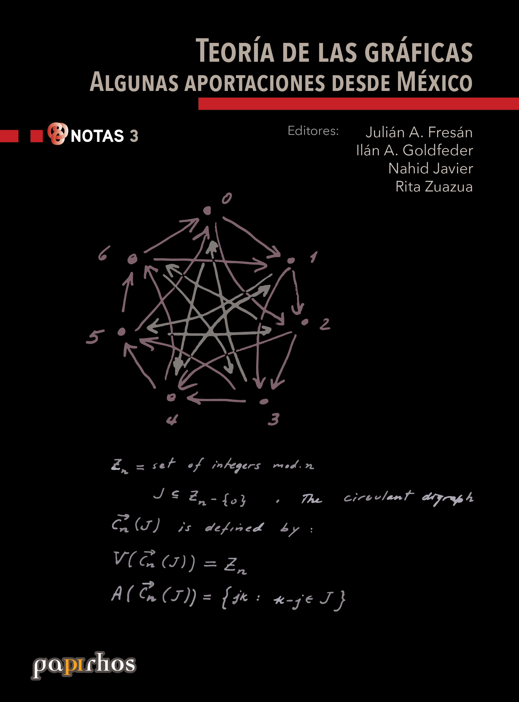

<section class="libro-hero">

Ficha bibliográfica

<h1 class="libro-titulo">Teoría de las gráficas: algunas aportaciones desde México</h1>

Notas Papirhos Físico

</section>

<section class="libro-seccion libro-resumen">
<h2>Resumen</h2>
Resumen proximamente
</section>

<section class="libro-seccion libro-ediciones">
<h2>Ediciones disponibles</h2>

    

        <button type="button" class="edition-button active" data-target="edicion-pap-not-3-0">Edición sin especificar</button>
    

    

        
<h3 class="edition-panel-title">Edición sin especificar</h3><section class="libro-subseccion libro-metadatos"><h3>Metadatos</h3>
<table>
    <tbody>
        <tr><th>Autores</th><td>Julian Fresán, Ilán Goldfeder, Nahid Javier, Rita Zuazua</td></tr><tr><th>Colección</th><td>Papirhos</td></tr><tr><th>Serie</th><td>Notas</td></tr><tr><th>Editorial</th><td>Instituto de Matemáticas, UNAM</td></tr><tr><th>ISBN (Colección)</th><td>000</td></tr>
    </tbody>
</table>
</section><section class="libro-subseccion libro-cita"><h3>Cómo citar</h3>
<blockquote id="cita-ed-017">Julian Fresán, Ilán Goldfeder, Nahid Javier, Rita Zuazua. <em>Teoría de las gráficas: algunas aportaciones desde México</em>. Instituto de Matemáticas, UNAM.</blockquote><button type="button" class="citation-copy-button" data-target="cita-ed-017">Copiar cita</button>

BibTeX
<textarea id="bibtex-ed-017" rows="9" cols="80" class="verbatim">@BOOK{ed-017,
title = {Teoría de las gráficas: algunas aportaciones desde México},
author = {Fresán, Julian and Goldfeder, Ilán and Javier, Nahid and Zuazua, Rita},
publisher = {Instituto de Matemáticas, UNAM},
address = {México}
}</textarea> <button type="button" class="bibtex-copy-button" data-target="bibtex-ed-017">Copiar BibTeX</button>
</section>

    

</section>

<section class="libro-seccion libro-seccion-descargas">
<h2>Descargas</h2>

<a class="md-button data-book-id=pap-not-3 download-link" data-book-id="pap-not-3" href = "pap-not-3_mark.pdf" target = "_blank" rel ="noopener" > Abrir PDF </a>
<a class="md-button  data-book-id=pap-not-3 download-link" data-book-id="pap-not-3" href ="pap-not-3_mark.pdf" download> Descargar</a>

 Ver en línea (vista previa)

<object data = "pap-not-3_mark.pdf" type="application/pdf" width="100%" height="700" >

 Tu navegador no puede mostrar PDF incrustado <a href="pap-not-3_mark.pdf" target="_blank" rel ="noopener"> Abrir PDF </a> o usa el botón "Descargar".

</object>

</section>

<a href="../../catalogo/" class="md-button md-button--primary">Volver al catálogo</a>
<a href="../../explorar/" class="md-button">Explorar libros</a>

