

    <section class="preprints-hero">

        

            Repositorio académico
        

        <h1>Preprints</h1>

        

            Consulta prepublicaciones y materiales académicos disponibles
            antes de su publicación editorial definitiva.
        

        

            Cada trabajo puede contar con distintas versiones a medida que
            se realizan correcciones o actualizaciones.
        

    </section>

    <section class="preprints-list">

        

            

                

                    Papirhos Preprints
                

                <h2>
                    Prepublicaciones recientes
                </h2>

            

        

        

            <label
                for="preprints-search-input"
                class="preprints-search-label">
                Buscar preprints
            </label>

            

                <input
                    type="search"
                    id="preprints-search-input"
                    placeholder="Buscar por título, autor, identificador o palabra clave..."
                    autocomplete="off">

            

            

            

            

                <a href="../explorar/">
                    Búsqueda avanzada →
                </a>
            

        

        

            <strong>
                No se encontraron preprints.
            </strong>

            
                Intenta con otro título, autor,
                identificador o palabra clave.
            

        

        <article class="preprint-card">

            

                
            

                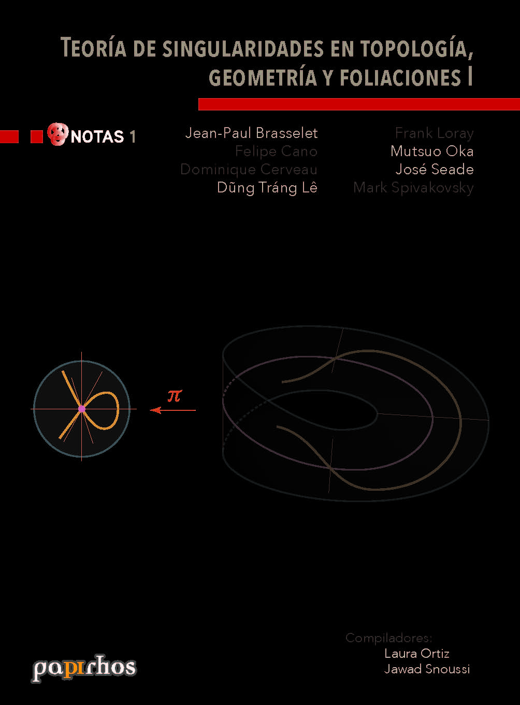

            

        

                

                    

                        
                            pap-not-1
                        

                        
                            Actualizado 2026-09-29
                        

                    

                    

                        <h3 class="preprint-title">

                            <a href="pap-not-1/">
                                Teoría de singularidades en topología, geometría y foliaciones I
                            </a>

                        </h3>

                        

                            Jean-Paul Brasselet · Felipe Cano · Dominique Cerveau · Dung Tráng Lê · Frank Loray · Mutsuo Oka · José Seade · Mark Spivakovsky
                        

                        

                            Este trabajo presenta una introducción general a distintos problemas matemáticos y sus posibles aplicaciones. Se describen algunas ideas principales, ejemplos sencillos y herramientas utilizadas para analizar los resultados. El objetivo es ofrecer una referencia accesible que permita comprender los conceptos fundamentales y sirva como punto de partida para estudios posteriores.
                        

                    

                    

                        

                            
                                v1
                            

                            
                                1 versión
                            

                        

                        

                            <a
                                href="pap-not-1/"
                                class="md-button md-button--primary">
                                Ver ficha
                            </a>

                            <a href="../archivos_preprints/pap-not-1-v1.pdf" class="md-button preprint-secondary-button">Ver PDF</a>

                        

                    

                

            

        </article>

        <article class="preprint-card">

            

                
            

                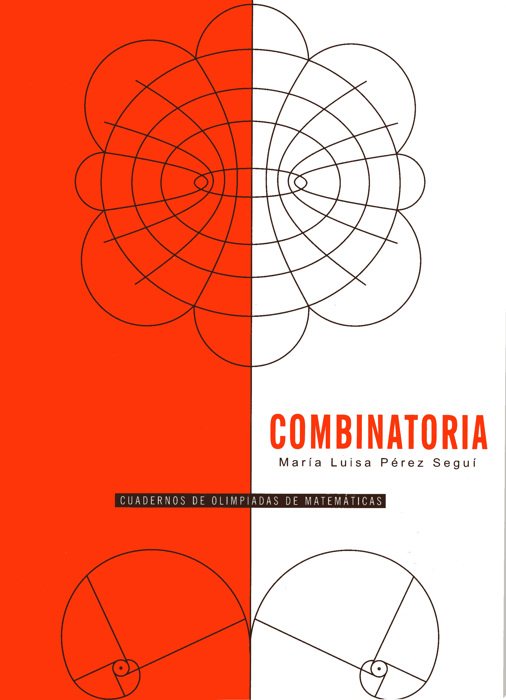

            

        

                

                    

                        
                            cuad-x-1
                        

                        
                            Actualizado 2026-09-29
                        

                    

                    

                        <h3 class="preprint-title">

                            <a href="cuad-x-1/">
                                Combinatoria
                            </a>

                        </h3>

                        

                            Maria Luisa Pérez Seguí
                        

                        

                            Resumen no disponible por el momento.
                        

                    

                    

                        

                            
                                v1
                            

                            
                                1 versión
                            

                        

                        

                            <a
                                href="cuad-x-1/"
                                class="md-button md-button--primary">
                                Ver ficha
                            </a>

                            <a href="../archivos_preprints/cuad-x-1-v1.pdf" class="md-button preprint-secondary-button">Ver PDF</a>

                        

                    

                

            

        </article>

        <article class="preprint-card">

            

                
            

                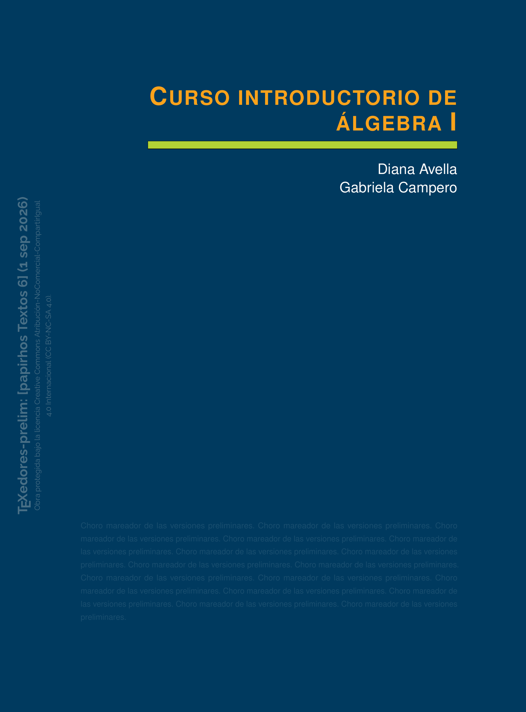

            

        

                

                    

                        
                            pap-tex-6
                        

                        
                            Actualizado 2026-09-29
                        

                    

                    

                        <h3 class="preprint-title">

                            <a href="pap-tex-6/">
                                Curso introductorio de álgebra I
                            </a>

                        </h3>

                        

                            Diana Avella · Gabriela Campero
                        

                        

                            El presente texto está dirigido a estudiantes del primer semestre de carreras en ciencias exactas. Contiene temas que los introducen al Álgebra y busca incorporar, a través de su tratamiento, una descripción minuciosa y rigurosa de los procedimientos de demostración y deducción necesarios para formar a los estudiantes en el pensamiento matemático abstracto. Conforme se presenta el material, se introduce al lector no sólo en el lenguaje de las matemáticas, sino en la forma de estructurar las ideas, desarrollarlas y escribir los diversos resultados. Es un texto con un grado elevado de rigor, claridad y pedagogía, que puede ser utilizado de manera autodidacta o como un complemento necesario para las clases en aula.  Este primer tomo está conformado por seis capítulos, cada uno con diversas secciones y un bloque de ejercicios cuidadosamente seleccionados; incluye nociones de lógica matemática y una introducción al manejo correcto de los conjuntos. Se expone también el concepto matemático de relación, dando un especial énfasis a las relaciones de equivalencia, y se aborda a profundidad el concepto de función. El capítulo quinto se centra en los números naturales, sus operaciones y su orden, inspeccionando detenidamente los principios de inducción y del buen orden, con numerosas demostraciones. El último capítulo versa sobre combinatoria finita, incorporando primero el concepto de cardinalidad en conjuntos finitos y los principios formales para contar de manera correcta.
                        

                    

                    

                        

                            
                                v1
                            

                            
                                1 versión
                            

                        

                        

                            <a
                                href="pap-tex-6/"
                                class="md-button md-button--primary">
                                Ver ficha
                            </a>

                            <a href="../archivos_preprints/pap-tex-6-v1.pdf" class="md-button preprint-secondary-button">Ver PDF</a>

                        

                    

                

            

        </article>

        <article class="preprint-card">

            

                
            

                

            

        

                

                    

                        
                            pap-tex-10
                        

                        
                            Actualizado 2026-09-29
                        

                    

                    

                        <h3 class="preprint-title">

                            <a href="pap-tex-10/">
                                Curso introductorio de álgebra II
                            </a>

                        </h3>

                        

                            Diana Avella · Gabriela Campero · Edith Corina Saenz Valadez
                        

                        

                            Resumen no disponible por el momento.
                        

                    

                    

                        

                            
                                v1
                            

                            
                                1 versión
                            

                        

                        

                            <a
                                href="pap-tex-10/"
                                class="md-button md-button--primary">
                                Ver ficha
                            </a>

                            <a href="../archivos_preprints/pap-tex-10-v1.pdf" class="md-button preprint-secondary-button">Ver PDF</a>

                        

                    

                

            

        </article>

        <article class="preprint-card">

            

                
            

                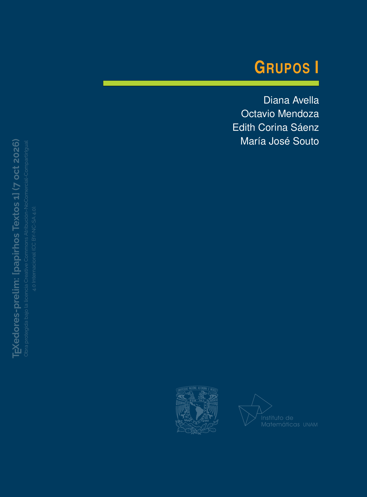

            

        

                

                    

                        
                            pap-tex-1
                        

                        
                            Actualizado 2026-09-29
                        

                    

                    

                        <h3 class="preprint-title">

                            <a href="pap-tex-1/">
                                Grupos I
                            </a>

                        </h3>

                        

                            Diana Avella · Octavio Mendoza · Edith Corina Saenz Valadez · María José Souto
                        

                        

                            Resumen no disponible por el momento.
                        

                    

                    

                        

                            
                                v1
                            

                            
                                1 versión
                            

                        

                        

                            <a
                                href="pap-tex-1/"
                                class="md-button md-button--primary">
                                Ver ficha
                            </a>

                            <a href="../archivos_preprints/pap-tex-1-v1.pdf" class="md-button preprint-secondary-button">Ver PDF</a>

                        

                    

                

            

        </article>

        <article class="preprint-card">

            

                
            

                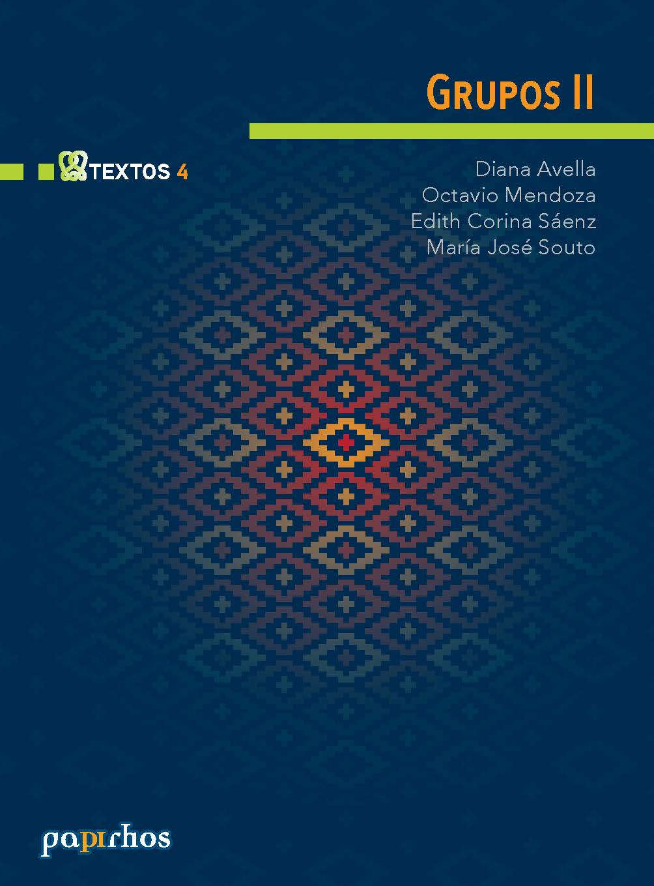

            

        

                

                    

                        
                            pap-tex-4
                        

                        
                            Actualizado 2026-09-29
                        

                    

                    

                        <h3 class="preprint-title">

                            <a href="pap-tex-4/">
                                Grupos II
                            </a>

                        </h3>

                        

                            Diana Avella · Octavio Mendoza · Edith Corina Saenz Valadez · María José Souto
                        

                        

                            Resumen no disponible por el momento.
                        

                    

                    

                        

                            
                                v1
                            

                            
                                1 versión
                            

                        

                        

                            <a
                                href="pap-tex-4/"
                                class="md-button md-button--primary">
                                Ver ficha
                            </a>

                            <a href="../archivos_preprints/pap-tex-4-v1.pdf" class="md-button preprint-secondary-button">Ver PDF</a>

                        

                    

                

            

        </article>

        <article class="preprint-card">

            

                
            

                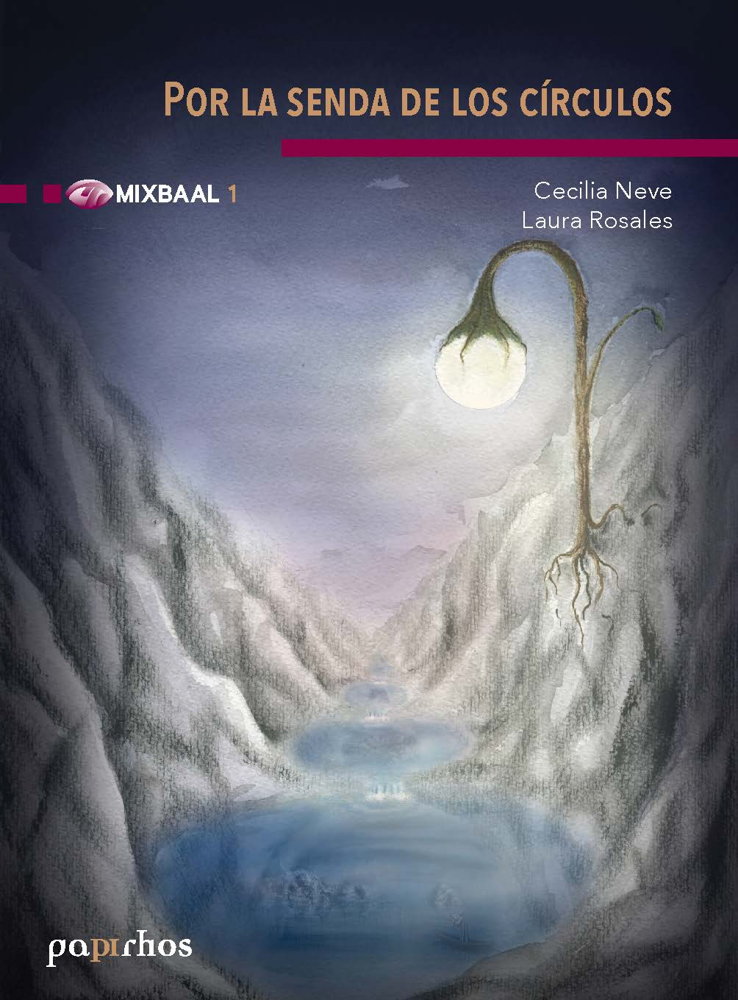

            

        

                

                    

                        
                            pap-mix-1
                        

                        
                            Actualizado 2026-09-29
                        

                    

                    

                        <h3 class="preprint-title">

                            <a href="pap-mix-1/">
                                Por la senda de los círculos
                            </a>

                        </h3>

                        

                            Cecilia Neve Jimenez · Laura Rosales Ortiz
                        

                        

                            Resumen no disponible por el momento.
                        

                    

                    

                        

                            
                                v1
                            

                            
                                1 versión
                            

                        

                        

                            <a
                                href="pap-mix-1/"
                                class="md-button md-button--primary">
                                Ver ficha
                            </a>

                            <a href="../archivos_preprints/pap-mix-1-v1.pdf" class="md-button preprint-secondary-button">Ver PDF</a>

                        

                    

                

            

        </article>

        <article class="preprint-card">

            

                
            

                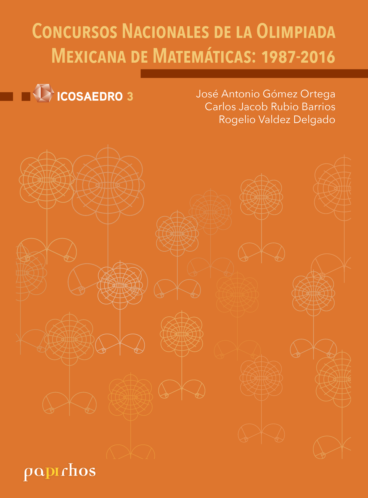

            

        

                

                    

                        
                            pap-ico-3
                        

                        
                            Actualizado 2026-09-29
                        

                    

                    

                        <h3 class="preprint-title">

                            <a href="pap-ico-3/">
                                Concursos Nacionales de la Olimpiada Mexicana de Matemáticas:1987-2016
                            </a>

                        </h3>

                        

                            Jose Antonio Gómez Ortega · Carlos Jacob Rubio Barrios · Rogelio Valdez Delgado
                        

                        

                            Resumen no disponible por el momento.
                        

                    

                    

                        

                            
                                v1
                            

                            
                                1 versión
                            

                        

                        

                            <a
                                href="pap-ico-3/"
                                class="md-button md-button--primary">
                                Ver ficha
                            </a>

                            <a href="../archivos_preprints/pap-ico-3-v1.pdf" class="md-button preprint-secondary-button">Ver PDF</a>

                        

                    

                

            

        </article>

        <article class="preprint-card">

            

                
            

                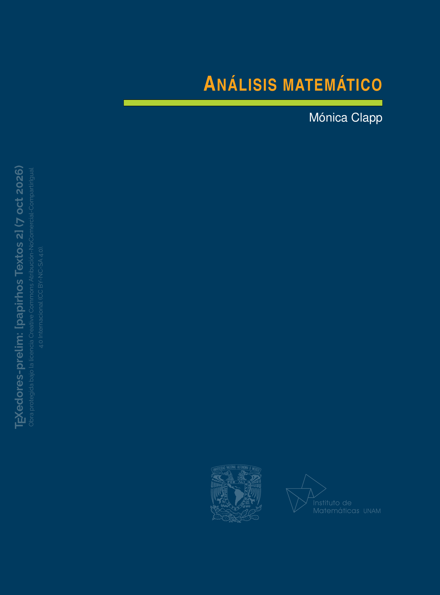

            

        

                

                    

                        
                            pap-tex-2
                        

                        
                            Actualizado 2026-09-29
                        

                    

                    

                        <h3 class="preprint-title">

                            <a href="pap-tex-2/">
                                Análisis Matemático
                            </a>

                        </h3>

                        

                            Mónica Clapp
                        

                        

                            Resumen no disponible por el momento.
                        

                    

                    

                        

                            
                                v1
                            

                            
                                1 versión
                            

                        

                        

                            <a
                                href="pap-tex-2/"
                                class="md-button md-button--primary">
                                Ver ficha
                            </a>

                            <a href="../archivos_preprints/pap-tex-2-v1.pdf" class="md-button preprint-secondary-button">Ver PDF</a>

                        

                    

                

            

        </article>

        <article class="preprint-card">

            

                
            

                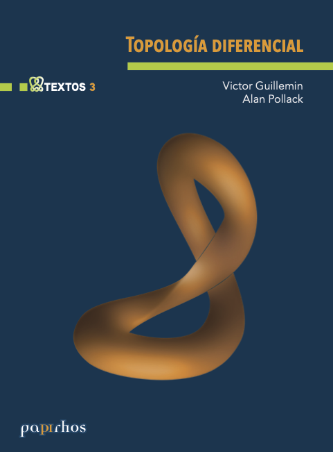

            

        

                

                    

                        
                            pap-tex-3
                        

                        
                            Actualizado 2026-09-29
                        

                    

                    

                        <h3 class="preprint-title">

                            <a href="pap-tex-3/">
                                Topología Diferencial
                            </a>

                        </h3>

                        

                            Victor Guillemin · Allan Pollack
                        

                        

                            Resumen no disponible por el momento.
                        

                    

                    

                        

                            
                                v1
                            

                            
                                1 versión
                            

                        

                        

                            <a
                                href="pap-tex-3/"
                                class="md-button md-button--primary">
                                Ver ficha
                            </a>

                            <a href="../archivos_preprints/pap-tex-3-v1.pdf" class="md-button preprint-secondary-button">Ver PDF</a>

                        

                    

                

            

        </article>

        <article class="preprint-card">

            

                
            

                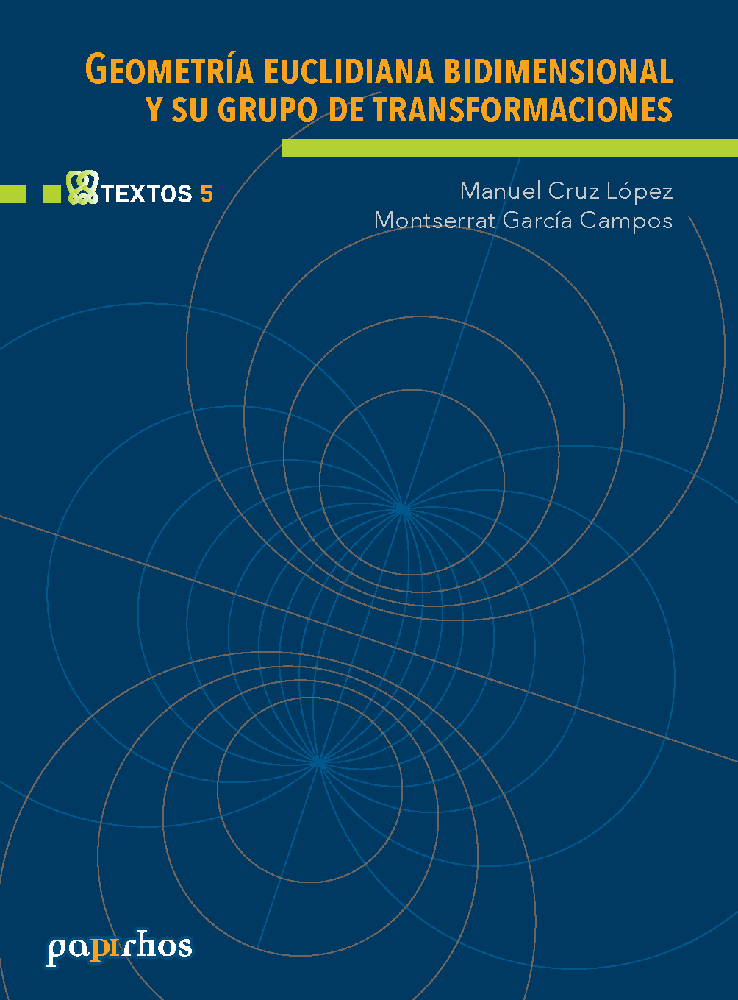

            

        

                

                    

                        
                            pap-tex-5
                        

                        
                            Actualizado 2026-09-29
                        

                    

                    

                        <h3 class="preprint-title">

                            <a href="pap-tex-5/">
                                Geometría euclidiana bidimensional y su grupo de transformaciones
                            </a>

                        </h3>

                        

                            Manuel Cruz · Montserrat García
                        

                        

                            Resumen no disponible por el momento.
                        

                    

                    

                        

                            
                                v1
                            

                            
                                1 versión
                            

                        

                        

                            <a
                                href="pap-tex-5/"
                                class="md-button md-button--primary">
                                Ver ficha
                            </a>

                            <a href="../archivos_preprints/pap-tex-5-v1.pdf" class="md-button preprint-secondary-button">Ver PDF</a>

                        

                    

                

            

        </article>

        <article class="preprint-card">

            

                
            

                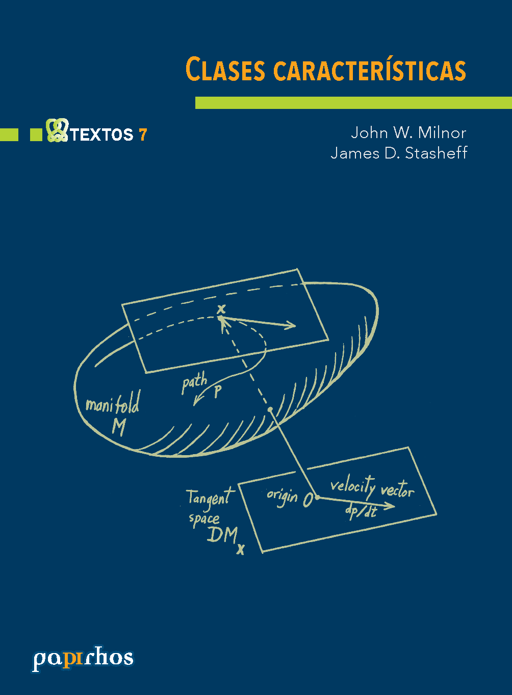

            

        

                

                    

                        
                            pap-tex-7
                        

                        
                            Actualizado 2026-09-29
                        

                    

                    

                        <h3 class="preprint-title">

                            <a href="pap-tex-7/">
                                Clases características
                            </a>

                        </h3>

                        

                            John Milnor · James Stasheff
                        

                        

                            Resumen no disponible por el momento.
                        

                    

                    

                        

                            
                                v1
                            

                            
                                1 versión
                            

                        

                        

                            <a
                                href="pap-tex-7/"
                                class="md-button md-button--primary">
                                Ver ficha
                            </a>

                            <a href="../archivos_preprints/pap-tex-7-v1.pdf" class="md-button preprint-secondary-button">Ver PDF</a>

                        

                    

                

            

        </article>

        <article class="preprint-card">

            

                
            

                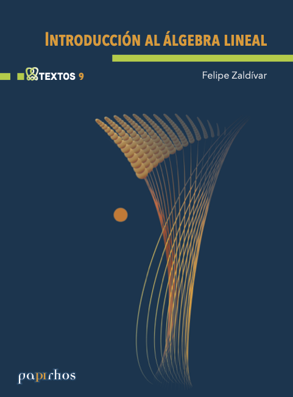

            

        

                

                    

                        
                            pap-tex-9
                        

                        
                            Actualizado 2026-09-29
                        

                    

                    

                        <h3 class="preprint-title">

                            <a href="pap-tex-9/">
                                Introducción al álgebra lineal
                            </a>

                        </h3>

                        

                            Felipe Zaldivar
                        

                        

                            Resumen no disponible por el momento.
                        

                    

                    

                        

                            
                                v1
                            

                            
                                1 versión
                            

                        

                        

                            <a
                                href="pap-tex-9/"
                                class="md-button md-button--primary">
                                Ver ficha
                            </a>

                            <a href="../archivos_preprints/pap-tex-9-v1.pdf" class="md-button preprint-secondary-button">Ver PDF</a>

                        

                    

                

            

        </article>

        <article class="preprint-card">

            

                
            

                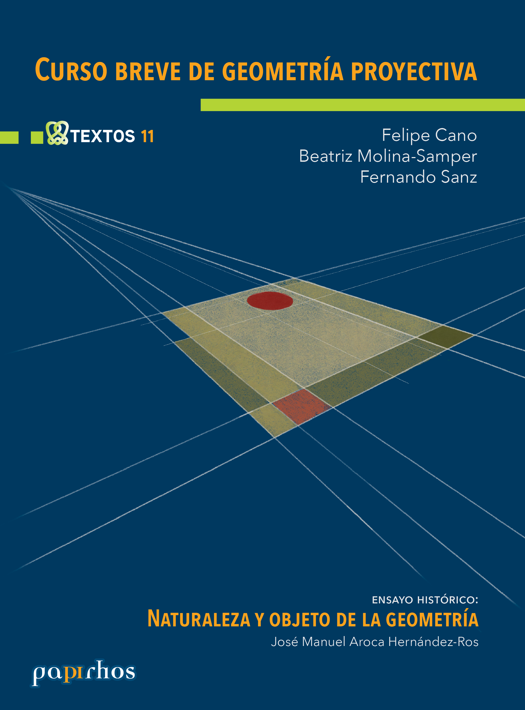

            

        

                

                    

                        
                            pap-tex-11
                        

                        
                            Actualizado 2026-09-29
                        

                    

                    

                        <h3 class="preprint-title">

                            <a href="pap-tex-11/">
                                Curso breve de geometría proyectiva
                            </a>

                        </h3>

                        

                            Felipe Cano · Beatriz Molina-Samper · Fernando Sanz
                        

                        

                            Resumen no disponible por el momento.
                        

                    

                    

                        

                            
                                v1
                            

                            
                                1 versión
                            

                        

                        

                            <a
                                href="pap-tex-11/"
                                class="md-button md-button--primary">
                                Ver ficha
                            </a>

                            <a href="../archivos_preprints/pap-tex-11-v1.pdf" class="md-button preprint-secondary-button">Ver PDF</a>

                        

                    

                

            

        </article>

        <article class="preprint-card">

            

                
            

                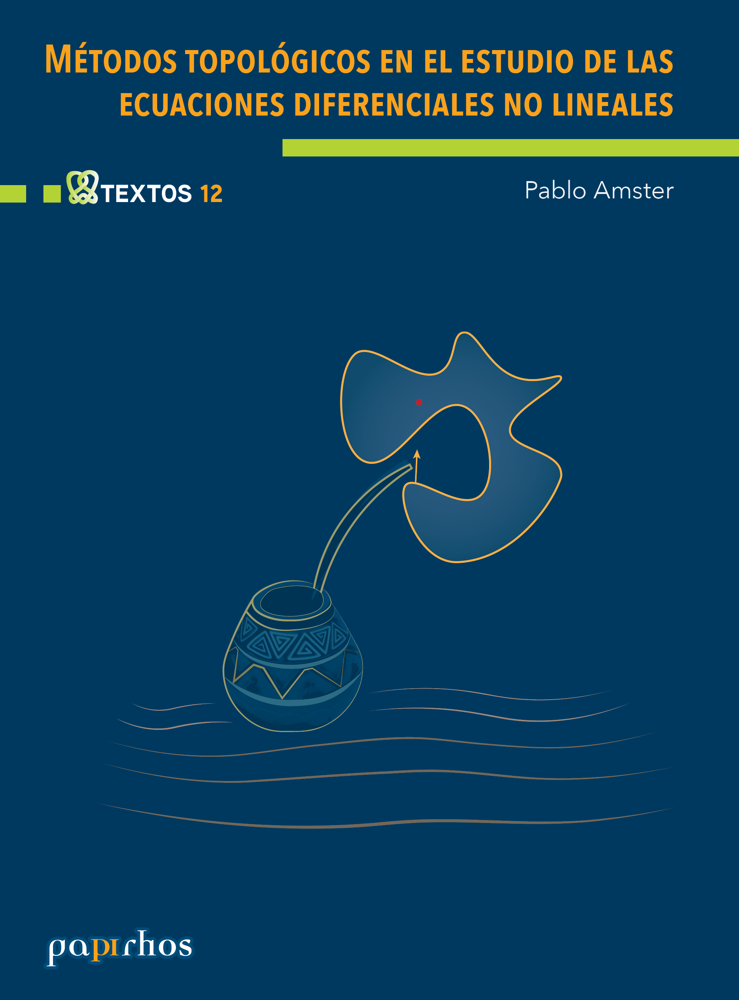

            

        

                

                    

                        
                            pap-tex-12
                        

                        
                            Actualizado 2026-09-29
                        

                    

                    

                        <h3 class="preprint-title">

                            <a href="pap-tex-12/">
                                Métodos topológicos en el estudio de las ecuaciones diferenciales no lineales
                            </a>

                        </h3>

                        

                            Pablo Amster
                        

                        

                            Resumen no disponible por el momento.
                        

                    

                    

                        

                            
                                v1
                            

                            
                                1 versión
                            

                        

                        

                            <a
                                href="pap-tex-12/"
                                class="md-button md-button--primary">
                                Ver ficha
                            </a>

                            <a href="../archivos_preprints/pap-tex-12-v1.pdf" class="md-button preprint-secondary-button">Ver PDF</a>

                        

                    

                

            

        </article>

        <article class="preprint-card">

            

                
            

                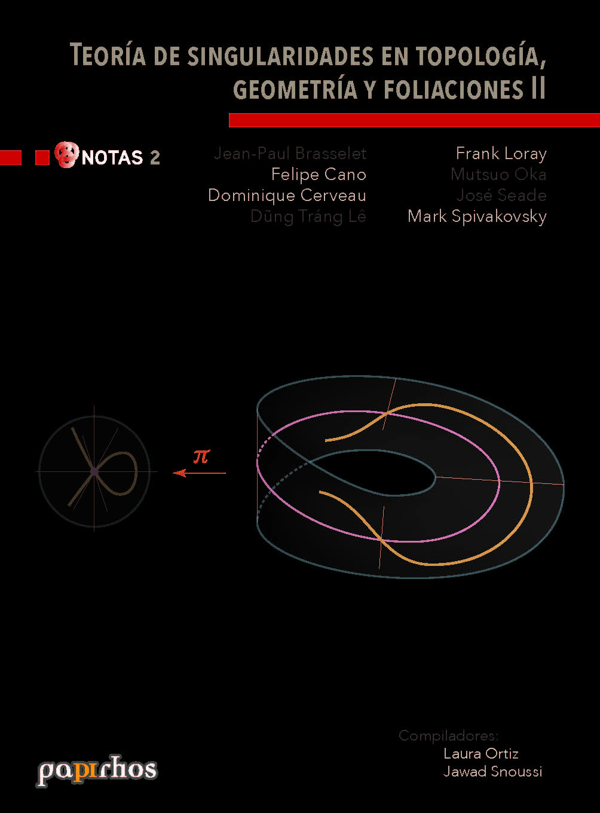

            

        

                

                    

                        
                            pap-not-2
                        

                        
                            Actualizado 2026-09-29
                        

                    

                    

                        <h3 class="preprint-title">

                            <a href="pap-not-2/">
                                Teoría de singularidades en topología, geometría y foliaciones II
                            </a>

                        </h3>

                        

                            Jean-Paul Brasselet · Felipe Cano · Dominique Cerveau · Dung Tráng Lê · Frank Loray · Mutsuo Oka · José Seade · Mark Spivakovsky
                        

                        

                            Resumen no disponible por el momento.
                        

                    

                    

                        

                            
                                v1
                            

                            
                                1 versión
                            

                        

                        

                            <a
                                href="pap-not-2/"
                                class="md-button md-button--primary">
                                Ver ficha
                            </a>

                            <a href="../archivos_preprints/pap-not-2-v1.pdf" class="md-button preprint-secondary-button">Ver PDF</a>

                        

                    

                

            

        </article>

        <article class="preprint-card">

            

                
            

                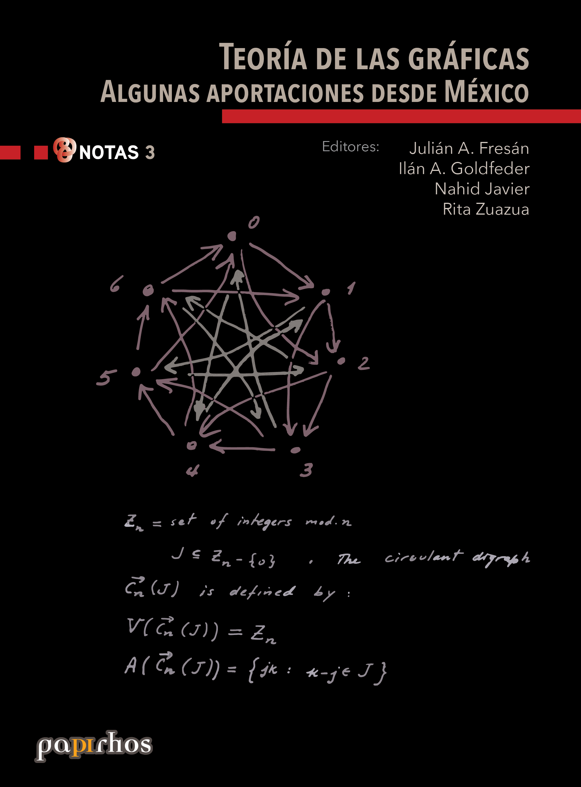

            

        

                

                    

                        
                            pap-not-3
                        

                        
                            Actualizado 2026-09-29
                        

                    

                    

                        <h3 class="preprint-title">

                            <a href="pap-not-3/">
                                Teoría de las gráficas: algunas aportaciones desde México
                            </a>

                        </h3>

                        

                            Julian Fresán · Ilán Goldfeder · Nahid Javier · Rita Zuazua
                        

                        

                            Resumen no disponible por el momento.
                        

                    

                    

                        

                            
                                v1
                            

                            
                                1 versión
                            

                        

                        

                            <a
                                href="pap-not-3/"
                                class="md-button md-button--primary">
                                Ver ficha
                            </a>

                            <a href="../archivos_preprints/pap-not-3-v1.pdf" class="md-button preprint-secondary-button">Ver PDF</a>

                        

                    

                

            

        </article>

        <article class="preprint-card">

            

                
            

                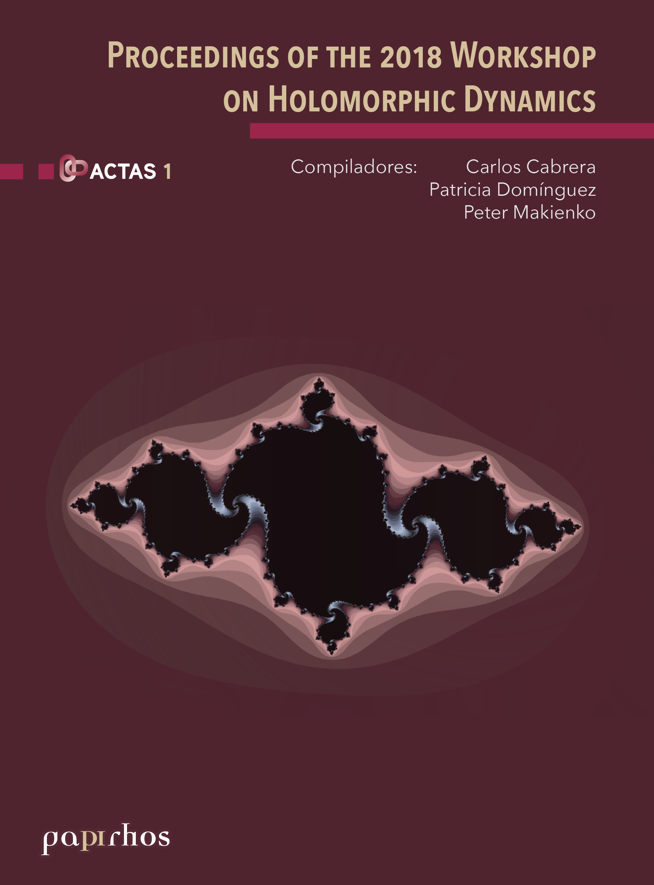

            

        

                

                    

                        
                            pap-act-1
                        

                        
                            Actualizado 2026-09-29
                        

                    

                    

                        <h3 class="preprint-title">

                            <a href="pap-act-1/">
                                Proceedings of the Workshop on Holomorphic Dynamics
                            </a>

                        </h3>

                        

                            Patricia Dominguez Soto · Peter Makienko · Carlos Cabrera Ocañas
                        

                        

                            Resumen no disponible por el momento.
                        

                    

                    

                        

                            
                                v1
                            

                            
                                1 versión
                            

                        

                        

                            <a
                                href="pap-act-1/"
                                class="md-button md-button--primary">
                                Ver ficha
                            </a>

                            <a href="../archivos_preprints/pap-act-1-v1.pdf" class="md-button preprint-secondary-button">Ver PDF</a>

                        

                    

                

            

        </article>

    </section>

