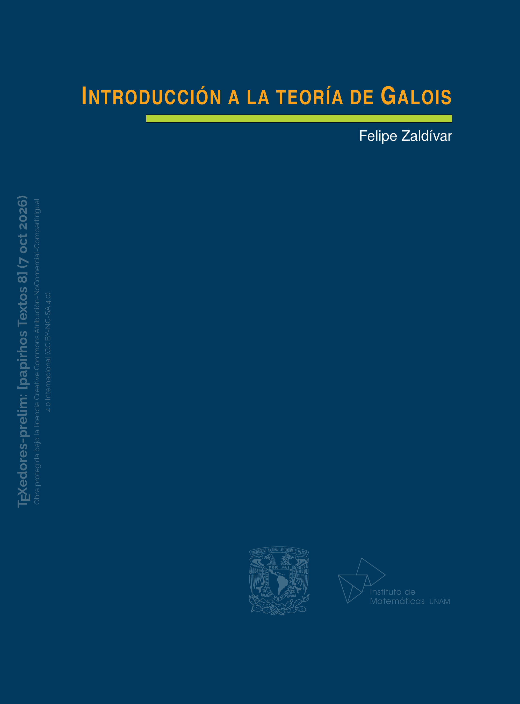
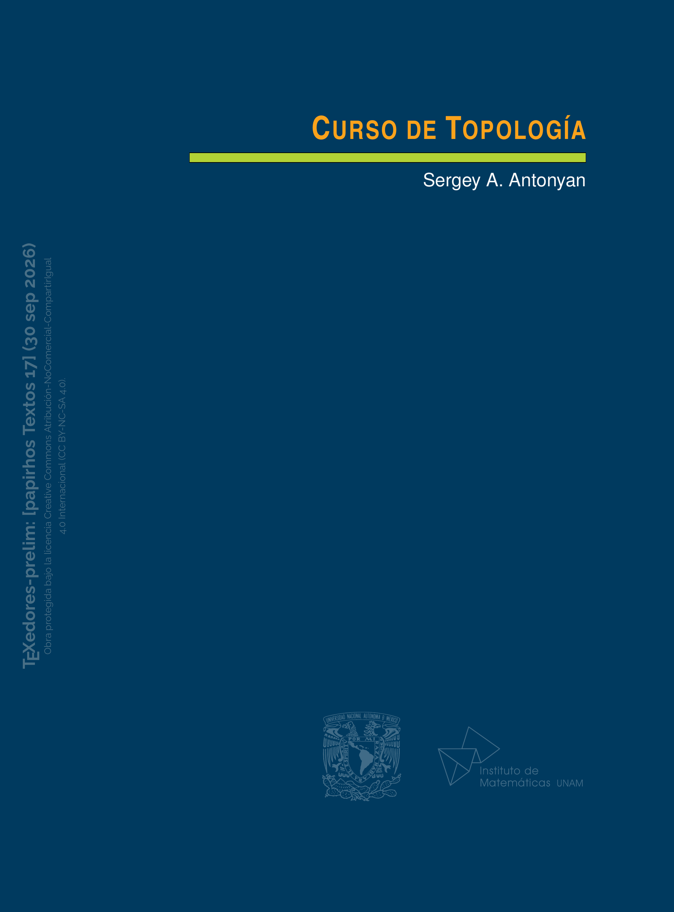

    <section class="preprints-hero">

        

            Repositorio académico
        

        <h1>Preprints</h1>

        

            Consulta prepublicaciones y materiales académicos disponibles
            antes de su publicación editorial definitiva.
        

        

            Cada trabajo puede contar con distintas versiones a medida que
            se realizan correcciones o actualizaciones.
        

    </section>

    <section class="preprints-list">

        

            

                

                    Papirhos Preprints
                

                <h2>
                    Prepublicaciones recientes
                </h2>

            

        

        

            <label
                for="preprints-search-input"
                class="preprints-search-label">
                Buscar preprints
            </label>

            

                <input
                    type="search"
                    id="preprints-search-input"
                    placeholder="Buscar por título, autor, identificador o palabra clave..."
                    autocomplete="off">

            

            

            

            

                <a href="../explorar/">
                    Búsqueda avanzada →
                </a>
            

        

        

            <strong>
                No se encontraron preprints.
            </strong>

            
                Intenta con otro título, autor,
                identificador o palabra clave.
            

        

        <article class="preprint-card">

            

                
            

                

            

        

                

                    

                        
                            pap-not-1
                        

                        
                            Actualizado 2026-09-29
                        

                    

                    

                        <h3 class="preprint-title">

                            <a href="pap-not-1/">
                                Teoría de singularidades en topología, geometría y foliaciones I
                            </a>

                        </h3>

                        

                            Jean-Paul Brasselet · Felipe Cano · Dominique Cerveau · Dung Tráng Lê · Frank Loray · Mutsuo Oka · José Seade · Mark Spivakovsky
                        

                        

                            

                                Este trabajo presenta una introducción general a distintos problemas matemáticos y sus posibles aplicaciones. Se describen algunas ideas principales, ejemplos sencillos y herramientas utilizadas para analizar los resultados. El objetivo es ofrecer una referencia accesible que permita comprender los conceptos fundamentales y sirva como punto de partida para estudios posteriores.
                            

                            <button
                                type="button"
                                class="preprint-summary-toggle">
                                Ver más
                            </button>

                        

                    

                    

                        

                            
                                v1
                            

                            
                                1 versión
                            

                        

                        

                            <a
                                href="pap-not-1/"
                                class="md-button md-button--primary">
                                Ver ficha
                            </a>

                            <a href="../archivos_preprints/pap-not-1-v1.pdf" class="md-button preprint-secondary-button">Ver PDF</a>

                        

                    

                

            

        </article>

        <article class="preprint-card">

            

                
            

                

            

        

                

                    

                        
                            cuad-x-1
                        

                        
                            Actualizado 2026-09-29
                        

                    

                    

                        <h3 class="preprint-title">

                            <a href="cuad-x-1/">
                                Combinatoria
                            </a>

                        </h3>

                        

                            Maria Luisa Pérez Seguí
                        

                        

                            

                                Resumen no disponible por el momento.
                            

                            <button
                                type="button"
                                class="preprint-summary-toggle">
                                Ver más
                            </button>

                        

                    

                    

                        

                            
                                v1
                            

                            
                                1 versión
                            

                        

                        

                            <a
                                href="cuad-x-1/"
                                class="md-button md-button--primary">
                                Ver ficha
                            </a>

                            <a href="../archivos_preprints/cuad-x-1-v1.pdf" class="md-button preprint-secondary-button">Ver PDF</a>

                        

                    

                

            

        </article>

        <article class="preprint-card">

            

                
            

                

            

        

                

                    

                        
                            pap-tex-6
                        

                        
                            Actualizado 2026-09-29
                        

                    

                    

                        <h3 class="preprint-title">

                            <a href="pap-tex-6/">
                                Curso introductorio de álgebra I
                            </a>

                        </h3>

                        

                            Diana Avella · Gabriela Campero
                        

                        

                            

                                El presente texto está dirigido a estudiantes del primer semestre de carreras en ciencias exactas. Contiene temas que los introducen al Álgebra y busca incorporar, a través de su tratamiento, una descripción minuciosa y rigurosa de los procedimientos de demostración y deducción necesarios para formar a los estudiantes en el pensamiento matemático abstracto. Conforme se presenta el material, se introduce al lector no sólo en el lenguaje de las matemáticas, sino en la forma de estructurar las ideas, desarrollarlas y escribir los diversos resultados. Es un texto con un grado elevado de rigor, claridad y pedagogía, que puede ser utilizado de manera autodidacta o como un complemento necesario para las clases en aula.  Este primer tomo está conformado por seis capítulos, cada uno con diversas secciones y un bloque de ejercicios cuidadosamente seleccionados; incluye nociones de lógica matemática y una introducción al manejo correcto de los conjuntos. Se expone también el concepto matemático de relación, dando un especial énfasis a las relaciones de equivalencia, y se aborda a profundidad el concepto de función. El capítulo quinto se centra en los números naturales, sus operaciones y su orden, inspeccionando detenidamente los principios de inducción y del buen orden, con numerosas demostraciones. El último capítulo versa sobre combinatoria finita, incorporando primero el concepto de cardinalidad en conjuntos finitos y los principios formales para contar de manera correcta.
                            

                            <button
                                type="button"
                                class="preprint-summary-toggle">
                                Ver más
                            </button>

                        

                    

                    

                        

                            
                                v1
                            

                            
                                1 versión
                            

                        

                        

                            <a
                                href="pap-tex-6/"
                                class="md-button md-button--primary">
                                Ver ficha
                            </a>

                            <a href="../archivos_preprints/pap-tex-6-v1.pdf" class="md-button preprint-secondary-button">Ver PDF</a>

                        

                    

                

            

        </article>

        <article class="preprint-card">

            

                
            

                

            

        

                

                    

                        
                            pap-tex-10
                        

                        
                            Actualizado 2026-09-29
                        

                    

                    

                        <h3 class="preprint-title">

                            <a href="pap-tex-10/">
                                Curso introductorio de álgebra II
                            </a>

                        </h3>

                        

                            Diana Avella · Gabriela Campero · Edith Corina Saenz Valadez
                        

                        

                            

                                Resumen no disponible por el momento.
                            

                            <button
                                type="button"
                                class="preprint-summary-toggle">
                                Ver más
                            </button>

                        

                    

                    

                        

                            
                                v1
                            

                            
                                1 versión
                            

                        

                        

                            <a
                                href="pap-tex-10/"
                                class="md-button md-button--primary">
                                Ver ficha
                            </a>

                            <a href="../archivos_preprints/pap-tex-10-v1.pdf" class="md-button preprint-secondary-button">Ver PDF</a>

                        

                    

                

            

        </article>

        <article class="preprint-card">

            

                
            

                

            

        

                

                    

                        
                            pap-tex-1
                        

                        
                            Actualizado 2026-09-29
                        

                    

                    

                        <h3 class="preprint-title">

                            <a href="pap-tex-1/">
                                Grupos I
                            </a>

                        </h3>

                        

                            Diana Avella · Octavio Mendoza · Edith Corina Saenz Valadez · María José Souto
                        

                        

                            

                                Grupos I es el primero de dos libros dedicados a uno de los hitos que revolucionaron el pensamiento matemático de su época, y que hasta nuestros días juega un papel esencial en el estudio sistemático de las ciencias: la Teoría de Grupos. En este tomo, los autores se dirigen al público en general al explicar de manera accesible algunos de los resultados clásicos de dicha teoría. Con años de experiencia docente, introducen también a los lectores en la abstracción y el arte de las demostraciones rigurosas. Además, el texto contiene una gran cantidad de notas históricas, ejemplos trabajados y ejercicios: inicia al revisar el conjunto de los números enteros que forman un grupo con la suma usual y, de manera paulatina, desarrolla una travesía por este apasionante tema. El presente volumen abarca la aritmética en el conjunto de los números enteros, por ejemplo, la divisibilidad, el algoritmo de la división y el de Euclides, las congruencias y la función φ de Euler. Asimismo, se analizan los grupos de permutaciones, los cíclicos, los normales y el grupo cociente. Finalmente, se introduce el concepto de homomorfismo de grupos y se demuestran los —tan usados en matemáticas— teoremas de isomorfismo.
                            

                            <button
                                type="button"
                                class="preprint-summary-toggle">
                                Ver más
                            </button>

                        

                    

                    

                        

                            
                                v1
                            

                            
                                1 versión
                            

                        

                        

                            <a
                                href="pap-tex-1/"
                                class="md-button md-button--primary">
                                Ver ficha
                            </a>

                            <a href="../archivos_preprints/pap-tex-1-v1.pdf" class="md-button preprint-secondary-button">Ver PDF</a>

                        

                    

                

            

        </article>

        <article class="preprint-card">

            

                
            

                

            

        

                

                    

                        
                            pap-tex-4
                        

                        
                            Actualizado 2026-09-29
                        

                    

                    

                        <h3 class="preprint-title">

                            <a href="pap-tex-4/">
                                Grupos II
                            </a>

                        </h3>

                        

                            Diana Avella · Octavio Mendoza · Edith Corina Saenz Valadez · María José Souto
                        

                        

                            

                                Resumen no disponible por el momento.
                            

                            <button
                                type="button"
                                class="preprint-summary-toggle">
                                Ver más
                            </button>

                        

                    

                    

                        

                            
                                v1
                            

                            
                                1 versión
                            

                        

                        

                            <a
                                href="pap-tex-4/"
                                class="md-button md-button--primary">
                                Ver ficha
                            </a>

                            <a href="../archivos_preprints/pap-tex-4-v1.pdf" class="md-button preprint-secondary-button">Ver PDF</a>

                        

                    

                

            

        </article>

        <article class="preprint-card">

            

                
            

                

            

        

                

                    

                        
                            pap-mix-1
                        

                        
                            Actualizado 2026-09-29
                        

                    

                    

                        <h3 class="preprint-title">

                            <a href="pap-mix-1/">
                                Por la senda de los círculos
                            </a>

                        </h3>

                        

                            Cecilia Neve Jimenez · Laura Rosales Ortiz
                        

                        

                            

                                Resumen no disponible por el momento.
                            

                            <button
                                type="button"
                                class="preprint-summary-toggle">
                                Ver más
                            </button>

                        

                    

                    

                        

                            
                                v1
                            

                            
                                1 versión
                            

                        

                        

                            <a
                                href="pap-mix-1/"
                                class="md-button md-button--primary">
                                Ver ficha
                            </a>

                            <a href="../archivos_preprints/pap-mix-1-v1.pdf" class="md-button preprint-secondary-button">Ver PDF</a>

                        

                    

                

            

        </article>

        <article class="preprint-card">

            

                
            

                

            

        

                

                    

                        
                            pap-ico-3
                        

                        
                            Actualizado 2026-09-29
                        

                    

                    

                        <h3 class="preprint-title">

                            <a href="pap-ico-3/">
                                Concursos Nacionales de la Olimpiada Mexicana de Matemáticas:1987-2016
                            </a>

                        </h3>

                        

                            Jose Antonio Gómez Ortega · Carlos Jacob Rubio Barrios · Rogelio Valdez Delgado
                        

                        

                            

                                Resumen no disponible por el momento.
                            

                            <button
                                type="button"
                                class="preprint-summary-toggle">
                                Ver más
                            </button>

                        

                    

                    

                        

                            
                                v1
                            

                            
                                1 versión
                            

                        

                        

                            <a
                                href="pap-ico-3/"
                                class="md-button md-button--primary">
                                Ver ficha
                            </a>

                            <a href="../archivos_preprints/pap-ico-3-v1.pdf" class="md-button preprint-secondary-button">Ver PDF</a>

                        

                    

                

            

        </article>

        <article class="preprint-card">

            

                
            

                

            

        

                

                    

                        
                            pap-tex-2
                        

                        
                            Actualizado 2026-09-29
                        

                    

                    

                        <h3 class="preprint-title">

                            <a href="pap-tex-2/">
                                Análisis Matemático
                            </a>

                        </h3>

                        

                            Mónica Clapp
                        

                        

                            

                                Este libro tan esperado en la Facultad de Ciencias de la Universidad Nacional Autónoma de México, y en diversas universidades de México y de países hispanoparlantes, es el resultado de muchos años de experiencia docente y de investigación por parte de la autora. Reúne material clave en la formación en análisis de los estudiantes dematemáticas y de otras carreras afines. Motivándolos por un problema concreto —la existencia de trayectorias de longitud mínima— la obra introduce gradualmente los conceptos básicos del análisis hasta llegar a los teoremas de punto fijo de Banach y de Arzelà-Azcoli, así como a diversas aplicaciones de ellos a la existencia de soluciones de ecuaciones diferenciales e integrales. Posteriormente presenta el concepto de diferenciabilidad en espacios de Banach y demuestra el teorema de la función implícita, que permite introducir el concepto de variedad y el estudio de problemas de minimización en variedades. La última parte de este texto se dedica a la teoría de integración de Lebesgue; introduce los espacios de Lebesgue y de Sobolev para concluir con algunas aplicaciones a la existencia de soluciones de problemas elípticos con condición de frontera.
                            

                            <button
                                type="button"
                                class="preprint-summary-toggle">
                                Ver más
                            </button>

                        

                    

                    

                        

                            
                                v1
                            

                            
                                1 versión
                            

                        

                        

                            <a
                                href="pap-tex-2/"
                                class="md-button md-button--primary">
                                Ver ficha
                            </a>

                            <a href="../archivos_preprints/pap-tex-2-v1.pdf" class="md-button preprint-secondary-button">Ver PDF</a>

                        

                    

                

            

        </article>

        <article class="preprint-card">

            

                
            

                

            

        

                

                    

                        
                            pap-tex-3
                        

                        
                            Actualizado 2026-09-29
                        

                    

                    

                        <h3 class="preprint-title">

                            <a href="pap-tex-3/">
                                Topología Diferencial
                            </a>

                        </h3>

                        

                            Victor Guillemin · Allan Pollack
                        

                        

                            

                                Resumen no disponible por el momento.
                            

                            <button
                                type="button"
                                class="preprint-summary-toggle">
                                Ver más
                            </button>

                        

                    

                    

                        

                            
                                v1
                            

                            
                                1 versión
                            

                        

                        

                            <a
                                href="pap-tex-3/"
                                class="md-button md-button--primary">
                                Ver ficha
                            </a>

                            <a href="../archivos_preprints/pap-tex-3-v1.pdf" class="md-button preprint-secondary-button">Ver PDF</a>

                        

                    

                

            

        </article>

        <article class="preprint-card">

            

                
            

                

            

        

                

                    

                        
                            pap-tex-5
                        

                        
                            Actualizado 2026-09-29
                        

                    

                    

                        <h3 class="preprint-title">

                            <a href="pap-tex-5/">
                                Geometría euclidiana bidimensional y su grupo de transformaciones
                            </a>

                        </h3>

                        

                            Manuel Cruz · Montserrat García
                        

                        

                            

                                Resumen no disponible por el momento.
                            

                            <button
                                type="button"
                                class="preprint-summary-toggle">
                                Ver más
                            </button>

                        

                    

                    

                        

                            
                                v1
                            

                            
                                1 versión
                            

                        

                        

                            <a
                                href="pap-tex-5/"
                                class="md-button md-button--primary">
                                Ver ficha
                            </a>

                            <a href="../archivos_preprints/pap-tex-5-v1.pdf" class="md-button preprint-secondary-button">Ver PDF</a>

                        

                    

                

            

        </article>

        <article class="preprint-card">

            

                
            

                

            

        

                

                    

                        
                            pap-tex-7
                        

                        
                            Actualizado 2026-09-29
                        

                    

                    

                        <h3 class="preprint-title">

                            <a href="pap-tex-7/">
                                Clases características
                            </a>

                        </h3>

                        

                            John Milnor · James Stasheff
                        

                        

                            

                                Resumen no disponible por el momento.
                            

                            <button
                                type="button"
                                class="preprint-summary-toggle">
                                Ver más
                            </button>

                        

                    

                    

                        

                            
                                v1
                            

                            
                                1 versión
                            

                        

                        

                            <a
                                href="pap-tex-7/"
                                class="md-button md-button--primary">
                                Ver ficha
                            </a>

                            <a href="../archivos_preprints/pap-tex-7-v1.pdf" class="md-button preprint-secondary-button">Ver PDF</a>

                        

                    

                

            

        </article>

        <article class="preprint-card">

            

                
            

                

            

        

                

                    

                        
                            pap-tex-8
                        

                        
                            Actualizado 2026-10-07
                        

                    

                    

                        <h3 class="preprint-title">

                            <a href="pap-tex-8/">
                                Introducción a la teoría de Galois
                            </a>

                        </h3>

                        

                            Felipe Zaldivar
                        

                        

                            

                                La teoría de Galois, cuyos orígenes se encuentran en el problema de la solubilidad de ecuaciones polinomiales mediante radicales, es una parte de la matemática con conexiones profundas a otras partes de la misma, como teoría de grupos, álgebra lineal, teoría de números y geometría algebraica, lo cual le da una riqueza y elegancia inigualables. En este libro se comienza introduciendo los resultados básicos de la teoría de anillos y campos eligiendo los aspectos que serán de utilidad en los temas de teoría de Galois que se tratan en el texto. El libro incluye ejemplos escogidos cuidadosamente para ilustrar la teoría desarrollada y motivar desarrollos posteriores. También se tiene un buen número de ejercicios que invitan al lector a participar activamente, ya sea en un curso de licenciatura o como auxiliar en autoestudio.
                            

                            <button
                                type="button"
                                class="preprint-summary-toggle">
                                Ver más
                            </button>

                        

                    

                    

                        

                            
                                v1
                            

                            
                                1 versión
                            

                        

                        

                            <a
                                href="pap-tex-8/"
                                class="md-button md-button--primary">
                                Ver ficha
                            </a>

                            <a href="../archivos_preprints/pap-tex-8-v1.pdf" class="md-button preprint-secondary-button">Ver PDF</a>

                        

                    

                

            

        </article>

        <article class="preprint-card">

            

                
            

                

            

        

                

                    

                        
                            pap-tex-9
                        

                        
                            Actualizado 2026-09-29
                        

                    

                    

                        <h3 class="preprint-title">

                            <a href="pap-tex-9/">
                                Introducción al álgebra lineal
                            </a>

                        </h3>

                        

                            Felipe Zaldivar
                        

                        

                            

                                Resumen no disponible por el momento.
                            

                            <button
                                type="button"
                                class="preprint-summary-toggle">
                                Ver más
                            </button>

                        

                    

                    

                        

                            
                                v1
                            

                            
                                1 versión
                            

                        

                        

                            <a
                                href="pap-tex-9/"
                                class="md-button md-button--primary">
                                Ver ficha
                            </a>

                            <a href="../archivos_preprints/pap-tex-9-v1.pdf" class="md-button preprint-secondary-button">Ver PDF</a>

                        

                    

                

            

        </article>

        <article class="preprint-card">

            

                
            

                

            

        

                

                    

                        
                            pap-tex-11
                        

                        
                            Actualizado 2026-09-29
                        

                    

                    

                        <h3 class="preprint-title">

                            <a href="pap-tex-11/">
                                Curso breve de geometría proyectiva
                            </a>

                        </h3>

                        

                            Felipe Cano · Beatriz Molina-Samper · Fernando Sanz
                        

                        

                            

                                Resumen no disponible por el momento.
                            

                            <button
                                type="button"
                                class="preprint-summary-toggle">
                                Ver más
                            </button>

                        

                    

                    

                        

                            
                                v1
                            

                            
                                1 versión
                            

                        

                        

                            <a
                                href="pap-tex-11/"
                                class="md-button md-button--primary">
                                Ver ficha
                            </a>

                            <a href="../archivos_preprints/pap-tex-11-v1.pdf" class="md-button preprint-secondary-button">Ver PDF</a>

                        

                    

                

            

        </article>

        <article class="preprint-card">

            

                
            

                

            

        

                

                    

                        
                            pap-tex-12
                        

                        
                            Actualizado 2026-09-29
                        

                    

                    

                        <h3 class="preprint-title">

                            <a href="pap-tex-12/">
                                Métodos topológicos en el estudio de las ecuaciones diferenciales no lineales
                            </a>

                        </h3>

                        

                            Pablo Amster
                        

                        

                            

                                Resumen no disponible por el momento.
                            

                            <button
                                type="button"
                                class="preprint-summary-toggle">
                                Ver más
                            </button>

                        

                    

                    

                        

                            
                                v1
                            

                            
                                1 versión
                            

                        

                        

                            <a
                                href="pap-tex-12/"
                                class="md-button md-button--primary">
                                Ver ficha
                            </a>

                            <a href="../archivos_preprints/pap-tex-12-v1.pdf" class="md-button preprint-secondary-button">Ver PDF</a>

                        

                    

                

            

        </article>

        <article class="preprint-card">

            

                
            

                

            

        

                

                    

                        
                            pap-not-2
                        

                        
                            Actualizado 2026-09-29
                        

                    

                    

                        <h3 class="preprint-title">

                            <a href="pap-not-2/">
                                Teoría de singularidades en topología, geometría y foliaciones II
                            </a>

                        </h3>

                        

                            Jean-Paul Brasselet · Felipe Cano · Dominique Cerveau · Dung Tráng Lê · Frank Loray · Mutsuo Oka · José Seade · Mark Spivakovsky
                        

                        

                            

                                Resumen no disponible por el momento.
                            

                            <button
                                type="button"
                                class="preprint-summary-toggle">
                                Ver más
                            </button>

                        

                    

                    

                        

                            
                                v1
                            

                            
                                1 versión
                            

                        

                        

                            <a
                                href="pap-not-2/"
                                class="md-button md-button--primary">
                                Ver ficha
                            </a>

                            <a href="../archivos_preprints/pap-not-2-v1.pdf" class="md-button preprint-secondary-button">Ver PDF</a>

                        

                    

                

            

        </article>

        <article class="preprint-card">

            

                
            

                

            

        

                

                    

                        
                            pap-not-3
                        

                        
                            Actualizado 2026-09-29
                        

                    

                    

                        <h3 class="preprint-title">

                            <a href="pap-not-3/">
                                Teoría de las gráficas: algunas aportaciones desde México
                            </a>

                        </h3>

                        

                            Julian Fresán · Ilán Goldfeder · Nahid Javier · Rita Zuazua
                        

                        

                            

                                Resumen no disponible por el momento.
                            

                            <button
                                type="button"
                                class="preprint-summary-toggle">
                                Ver más
                            </button>

                        

                    

                    

                        

                            
                                v1
                            

                            
                                1 versión
                            

                        

                        

                            <a
                                href="pap-not-3/"
                                class="md-button md-button--primary">
                                Ver ficha
                            </a>

                            <a href="../archivos_preprints/pap-not-3-v1.pdf" class="md-button preprint-secondary-button">Ver PDF</a>

                        

                    

                

            

        </article>

        <article class="preprint-card">

            

                
            

                

            

        

                

                    

                        
                            pap-act-1
                        

                        
                            Actualizado 2026-09-29
                        

                    

                    

                        <h3 class="preprint-title">

                            <a href="pap-act-1/">
                                Proceedings of the Workshop on Holomorphic Dynamics
                            </a>

                        </h3>

                        

                            Patricia Dominguez Soto · Peter Makienko · Carlos Cabrera Ocañas
                        

                        

                            

                                Resumen no disponible por el momento.
                            

                            <button
                                type="button"
                                class="preprint-summary-toggle">
                                Ver más
                            </button>

                        

                    

                    

                        

                            
                                v1
                            

                            
                                1 versión
                            

                        

                        

                            <a
                                href="pap-act-1/"
                                class="md-button md-button--primary">
                                Ver ficha
                            </a>

                            <a href="../archivos_preprints/pap-act-1-v1.pdf" class="md-button preprint-secondary-button">Ver PDF</a>

                        

                    

                

            

        </article>

        <article class="preprint-card">

            

                
            

                

            

        

                

                    

                        
                            apor-tex-12
                        

                        
                            Actualizado 2026-09-29
                        

                    

                    

                        <h3 class="preprint-title">

                            <a href="apor-tex-12/">
                                Introducción a la teoría de redes
                            </a>

                        </h3>

                        

                            María del Carmen Hernández Ayuso
                        

                        

                            

                                Este libro está enfocado a los temas básicos de teoría de redes. Se presentan tanto teoría general y características de los problemas de optimización de esta rama como algoritmos para resolverlos. Se exponen cuatro problemas básicos: árbol de peso mínimo, ruta más corta, flujo máximo y flujo a costo mínimo; estos problemas han sido resueltos principalmente mediante dos enfoques generales. Uno consiste en especializar los algoritmos de programación lineal aprovechando la estructura de cada problema y el otro en aplicar resultados de teoría de gráficas. En los primeros cinco capítulos se presentan algunos algoritmos para resolver problemas de flujo en redes según el enfoque clásico de la programación lineal. En los últimos dos capítulos se presentan generalizaciones de dos de estos problemas según el enfoque de coloración en gráficas. La teoría de dualidad ha sido estudiada para el caso de los modelos de redes; con esto se han generado algoritmos de solución simultánea para el par de problemas duales. Este es el caso de los problemas de flujo máximo y de cadena mínima. En cada capítulo se incluyen conceptos, resultados teóricos rigurosamente demostrados, técnicas, ejemplos numéricos y una series de ejercicios propuestos.
                            

                            <button
                                type="button"
                                class="preprint-summary-toggle">
                                Ver más
                            </button>

                        

                    

                    

                        

                            
                                v1
                            

                            
                                1 versión
                            

                        

                        

                            <a
                                href="apor-tex-12/"
                                class="md-button md-button--primary">
                                Ver ficha
                            </a>

                            <a href="../archivos_preprints/apor-tex-12-v1.pdf" class="md-button preprint-secondary-button">Ver PDF</a>

                        

                    

                

            

        </article>

        <article class="preprint-card">

            

                
            

                

            

        

                

                    

                        
                            pap-tex-17
                        

                        
                            Actualizado 2026-09-29
                        

                    

                    

                        <h3 class="preprint-title">

                            <a href="pap-tex-17/">
                                Curso de Topología
                            </a>

                        </h3>

                        

                            Sergey A. Antonyan
                        

                        

                            

                                Resumen no disponible por el momento.
                            

                            <button
                                type="button"
                                class="preprint-summary-toggle">
                                Ver más
                            </button>

                        

                    

                    

                        

                            
                                v1
                            

                            
                                1 versión
                            

                        

                        

                            <a
                                href="pap-tex-17/"
                                class="md-button md-button--primary">
                                Ver ficha
                            </a>

                            <a href="../archivos_preprints/pap-tex-17-v1.pdf" class="md-button preprint-secondary-button">Ver PDF</a>

                        

                    

                

            

        </article>

        <article class="preprint-card">

            

                
            

                

            

        

                

                    

                        
                            pap-tex-18
                        

                        
                            Actualizado 2026-09-29
                        

                    

                    

                        <h3 class="preprint-title">

                            <a href="pap-tex-18/">
                                Métodos variacionales en ecuaciones diferenciales parciales no lineales
                            </a>

                        </h3>

                        

                            Mónica Clapp
                        

                        

                            

                                Resumen no disponible por el momento.
                            

                            <button
                                type="button"
                                class="preprint-summary-toggle">
                                Ver más
                            </button>

                        

                    

                    

                        

                            
                                v1
                            

                            
                                1 versión
                            

                        

                        

                            <a
                                href="pap-tex-18/"
                                class="md-button md-button--primary">
                                Ver ficha
                            </a>

                            <a href="../archivos_preprints/pap-tex-18-v1.pdf" class="md-button preprint-secondary-button">Ver PDF</a>

                        

                    

                

            

        </article>

    </section>

