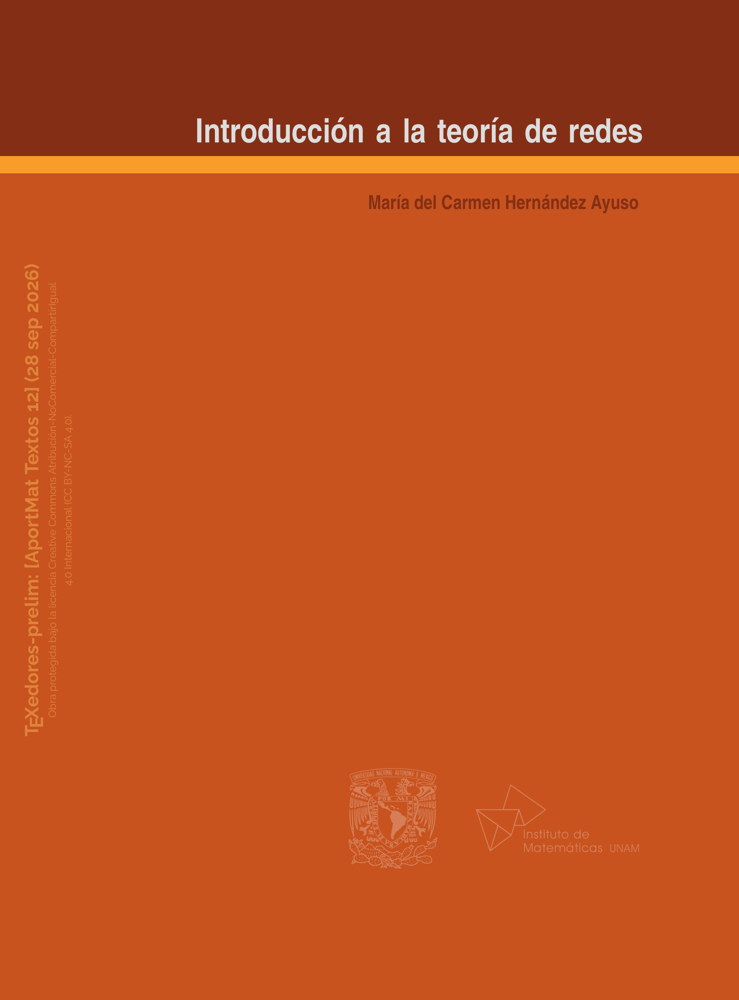

<section class="preprint-detail-hero">

    
            

                

            

        

    

        

            Preprint · apor-tex-12
        

        <h1>
            Introducción a la teoría de redes
        </h1>

        

            María del Carmen Hernández Ayuso
        

        

            
                v1 actual
            

            
                2026-09-29
            

        

        

            
            <a
                href="../../archivos_preprints/apor-tex-12-v1.pdf"
                class="md-button md-button--primary">

                Ver PDF

            </a>
        

            <a
                href="../"
                class="md-button preprint-secondary-button">

                Volver a Preprints

            </a>

        

    

</section>

<section class="libro-seccion libro-resumen preprint-resumen">

    <h2>
        Resumen
    </h2>

    

        Este libro está enfocado a los temas básicos de teoría de redes. Se presentan tanto teoría general y características de los problemas de optimización de esta rama como algoritmos para resolverlos. Se exponen cuatro problemas básicos: árbol de peso mínimo, ruta más corta, flujo máximo y flujo a costo mínimo; estos problemas han sido resueltos principalmente mediante dos enfoques generales. Uno consiste en especializar los algoritmos de programación lineal aprovechando la estructura de cada problema y el otro en aplicar resultados de teoría de gráficas. En los primeros cinco capítulos se presentan algunos algoritmos para resolver problemas de flujo en redes según el enfoque clásico de la programación lineal. En los últimos dos capítulos se presentan generalizaciones de dos de estos problemas según el enfoque de coloración en gráficas. La teoría de dualidad ha sido estudiada para el caso de los modelos de redes; con esto se han generado algoritmos de solución simultánea para el par de problemas duales. Este es el caso de los problemas de flujo máximo y de cadena mínima. En cada capítulo se incluyen conceptos, resultados teóricos rigurosamente demostrados, técnicas, ejemplos numéricos y una series de ejercicios propuestos.
    

</section>

<section class="libro-seccion preprint-version-section">

    <h2>
        Versión actual
    </h2>

    

        

            

                

                    Versión vigente
                

                

                    
                        v1
                    

                    
                        2026-09-29
                    

                

            

            <a
                href="../../archivos_preprints/apor-tex-12-v1.pdf"
                class="md-button md-button--primary">

                Ver PDF

            </a>

        

        

            
                Cambios en esta versión
            

            

                Primera versión disponible en Papirhos Preprints.
            

        

    

</section>

<section class="libro-seccion preprint-citation-section">

    <h2>
        Cómo citar
    </h2>

    

        

            

                María del Carmen Hernández Ayuso. (2026). Introducción a la teoría de redes. Papirhos Preprints, apor-tex-12, v1. https://kavallemon-t.github.io/papirhos-preprints/preprints/apor-tex-12/

            

        

        <button
            type="button"
            class="citation-copy-button"
            data-target="cita-actual-apor-tex-12">

            Copiar cita

        </button>

    

    

        

            BibTeX
        

        

            <textarea
                id="bibtex-actual-apor-tex-12"
                rows="7"
                cols="80"
                class="verbatim preprint-bibtex-area">@misc{apor-tex-12v1,
  author = {María del Carmen Hernández Ayuso},
  title = {Introducción a la teoría de redes},
  year = {2026},
  note = {Papirhos Preprints: apor-tex-12, v1},
  url = {https://kavallemon-t.github.io/papirhos-preprints/preprints/apor-tex-12/}
}</textarea>

            <button
                type="button"
                class="bibtex-copy-button"
                data-target="bibtex-actual-apor-tex-12">

                Copiar BibTeX

            </button>

        

    

</section>

<section class="libro-seccion preprint-history-section">

    <h2>
        Historial de versiones
    </h2>

    

        Consulta las versiones anteriores de este preprint,
        sus fechas de publicación y los cambios realizados.
    

    

        <article class="preprint-history-card">

            

                

                    
                        v1
                    

                    Actual

                

                
                    2026-09-29
                

            

            

                

                    
                        Cambios
                    

                    

                        Primera versión disponible en Papirhos Preprints.
                    

                

                <a
                    href="../../archivos_preprints/apor-tex-12-v1.pdf"
                    class="md-button preprint-secondary-button">

                    Ver PDF

                </a>

            

            

                

                    Citación y BibTeX
                

                

                    

                        

                            

                                María del Carmen Hernández Ayuso. (2026). Introducción a la teoría de redes. Papirhos Preprints, apor-tex-12, v1. https://kavallemon-t.github.io/papirhos-preprints/preprints/apor-tex-12/

                            

                        

                        <button
                            type="button"
                            class="citation-copy-button"
                            data-target="cita-apor-tex-12-v1">

                            Copiar cita

                        </button>

                    

                    

                        

                            BibTeX
                        

                        <textarea
                            id="bibtex-apor-tex-12-v1"
                            rows="7"
                            cols="80"
                            class="verbatim preprint-bibtex-area">@misc{apor-tex-12v1,
  author = {María del Carmen Hernández Ayuso},
  title = {Introducción a la teoría de redes},
  year = {2026},
  note = {Papirhos Preprints: apor-tex-12, v1},
  url = {https://kavallemon-t.github.io/papirhos-preprints/preprints/apor-tex-12/}
}</textarea>

                        <button
                            type="button"
                            class="bibtex-copy-button"
                            data-target="bibtex-apor-tex-12-v1">

                            Copiar BibTeX

                        </button>

                    

                

            

        </article>

    

</section>

