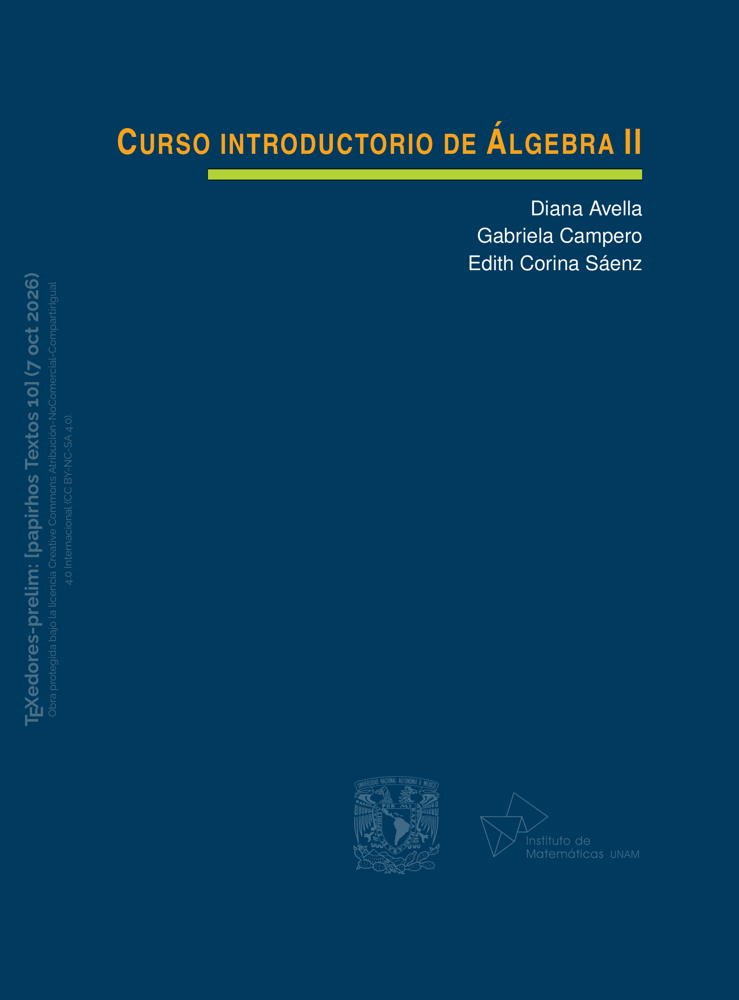

<section class="preprint-detail-hero">

    
            

                

            

        

    

        

            Preprint · pap-tex-10
        

        <h1>
            Curso introductorio de álgebra II
        </h1>

        

            Diana Avella · Gabriela Campero · Edith Corina Sáenz
        

        

            
                v1 actual
            

            
                2026-10-07
            

        

        

            
            <a
                href="../../archivos_preprints/pap-tex-10-v1.pdf"
                class="md-button md-button--primary">

                Ver PDF

            </a>
        

            <a
                href="../"
                class="md-button preprint-secondary-button">

                Volver a Preprints

            </a>

        

    

</section>

<section class="libro-seccion libro-resumen preprint-resumen">

    <h2>
        Resumen
    </h2>

    

        El presente texto, segundo tomo de la serie, está dirigido a estudiantes del primer semestre de carreras en ciencias exactas. Contiene temas que los introducen al Álgebra y busca incorporar, a través de su tratamiento, una descripción minuciosa y rigurosa de los procedimientos de demostración y deducción necesarios para formar a los estudiantes en el pensamiento matemático abstracto. Es un texto con un grado elevado de rigor, claridad y pedagogía, que puede ser utilizado de manera autodidacta o como un complemento necesario para las clases en aula.  Este tomo está conformado por cuatro capítulos; cada capítulo contiene bloques de ejercicios cuidadosamente seleccionados. En ellos se desarrolla la construcción de los números enteros y temas relacionados con esta estructura numérica. Una vez expuesta dicha construcción, se describen a detalle las características que lo llevan a ser un dominio entero. Posteriormente damos una introducción a estructuras algebraicas como son un grupo, un anillo y un dominio entero. El tercer capítulo versa sobre la noción de divisibilidad en los enteros, que incluye una exposición del algoritmo de la división, los conceptos de máximo común divisor, de mínimo común múltiplo, y de número primo. El cuarto capítulo expone el tema de congruencias en los enteros, visitando el anillo formado por las clases de equivalencia de los enteros módulo un entero positivo, además de explorar las ecuaciones con congruencias y sistemas formados con estas ecuaciones.
    

</section>

<section class="libro-seccion preprint-version-section">

    <h2>
        Versión actual
    </h2>

    

        

            

                

                    Versión vigente
                

                

                    
                        v1
                    

                    
                        2026-10-07
                    

                

            

            <a
                href="../../archivos_preprints/pap-tex-10-v1.pdf"
                class="md-button md-button--primary">

                Ver PDF

            </a>

        

        

            
                Cambios en esta versión
            

            

                Primera versión disponible en Papirhos Preprints.
            

        

    

</section>

<section class="libro-seccion preprint-citation-section">

    <h2>
        Cómo citar
    </h2>

    

        

            

                Diana Avella, Gabriela Campero, Edith Corina Sáenz. (2026). Curso introductorio de álgebra II. Papirhos Preprints, pap-tex-10, v1. https://kavallemon-t.github.io/papirhos-preprints/preprints/pap-tex-10/

            

        

        <button
            type="button"
            class="citation-copy-button"
            data-target="cita-actual-pap-tex-10">

            Copiar cita

        </button>

    

    

        

            BibTeX
        

        

            <textarea
                id="bibtex-actual-pap-tex-10"
                rows="7"
                cols="80"
                class="verbatim preprint-bibtex-area">@misc{pap-tex-10v1,
  author = {Diana Avella and Gabriela Campero and Edith Corina Sáenz},
  title = {Curso introductorio de álgebra II},
  year = {2026},
  note = {Papirhos Preprints: pap-tex-10, v1},
  url = {https://kavallemon-t.github.io/papirhos-preprints/preprints/pap-tex-10/}
}</textarea>

            <button
                type="button"
                class="bibtex-copy-button"
                data-target="bibtex-actual-pap-tex-10">

                Copiar BibTeX

            </button>

        

    

</section>

<section class="libro-seccion preprint-history-section">

    <h2>
        Historial de versiones
    </h2>

    

        Consulta las versiones anteriores de este preprint,
        sus fechas de publicación y los cambios realizados.
    

    

        <article class="preprint-history-card">

            

                

                    
                        v1
                    

                    Actual

                

                
                    2026-10-07
                

            

            

                

                    
                        Cambios
                    

                    

                        Primera versión disponible en Papirhos Preprints.
                    

                

                <a
                    href="../../archivos_preprints/pap-tex-10-v1.pdf"
                    class="md-button preprint-secondary-button">

                    Ver PDF

                </a>

            

            

                

                    Citación y BibTeX
                

                

                    

                        

                            

                                Diana Avella, Gabriela Campero, Edith Corina Sáenz. (2026). Curso introductorio de álgebra II. Papirhos Preprints, pap-tex-10, v1. https://kavallemon-t.github.io/papirhos-preprints/preprints/pap-tex-10/

                            

                        

                        <button
                            type="button"
                            class="citation-copy-button"
                            data-target="cita-pap-tex-10-v1">

                            Copiar cita

                        </button>

                    

                    

                        

                            BibTeX
                        

                        <textarea
                            id="bibtex-pap-tex-10-v1"
                            rows="7"
                            cols="80"
                            class="verbatim preprint-bibtex-area">@misc{pap-tex-10v1,
  author = {Diana Avella and Gabriela Campero and Edith Corina Sáenz},
  title = {Curso introductorio de álgebra II},
  year = {2026},
  note = {Papirhos Preprints: pap-tex-10, v1},
  url = {https://kavallemon-t.github.io/papirhos-preprints/preprints/pap-tex-10/}
}</textarea>

                        <button
                            type="button"
                            class="bibtex-copy-button"
                            data-target="bibtex-pap-tex-10-v1">

                            Copiar BibTeX

                        </button>

                    

                

            

        </article>

    

</section>

