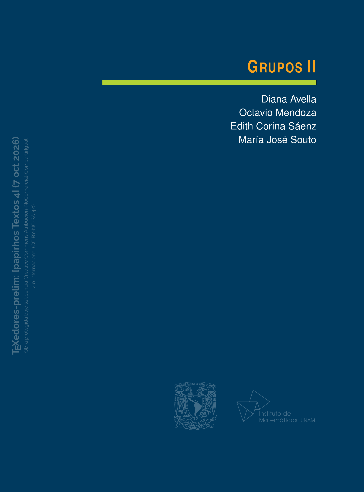

<section class="preprint-detail-hero">

    
            

                

            

        

    

        

            Preprint · pap-tex-4
        

        <h1>
            Grupos II
        </h1>

        

            Diana Avella · Octavio Mendoza · Edith Corina Saenz Valadez · María José Souto
        

        

            
                v1 actual
            

            
                2026-10-07
            

        

        

            
            <a
                href="../../archivos_preprints/pap-tex-4-v1.pdf"
                class="md-button md-button--primary">

                Ver PDF

            </a>
        

            <a
                href="../"
                class="md-button preprint-secondary-button">

                Volver a Preprints

            </a>

        

    

</section>

<section class="libro-seccion libro-resumen preprint-resumen">

    <h2>
        Resumen
    </h2>

    

        Grupos II es el segundo libro dedicado a un área fascinante de las matemáticas: la Teoría de Grupos. Este volumen está dirigido a estudiantes de matemáticas, física y otras áreas científicas en las que tengan ya cierto conocimiento del tema y deseen ahondar en él. Consta de cinco capítulos: <i>Acciones de grupos en conjuntos, Acciones especiales de grupos en conjuntos, Teoremas de Sylow, Grupos abelianos finitos</i> y, por último, <i>Grupos solubles y nilpotentes.</i>  En este texto, los autores profundizan el estudio del tema de los grupos, presentando algunos conceptos y resultados que se plantean usualmente al final de un curso básico de licenciatura de Teoría de Grupos, junto con otros que son más apropiados para un curso avanzado de la materia, de acuerdo con el parecer de los autores. Los capítulos <i>Acciones de grupos</i> y <i>Teoremas de Sylow</i> fueron escritos con la intención de completar el material del primer curso de Álgebra Moderna de la licenciatura en matemáticas.  Si bien el estudio de la estructura de los grupos abelianos finitos se puede iniciar en un curso de nivel licenciatura, el material presentado en el capítulo correspondiente se aborda con una profundidad que va mucho más allá de ese primer encuentro. De manera similar, el último capítulo de grupos solubles y nilpotentes puede ser utilizado para un curso avanzado de teoría de grupos.  Al igual que en el primer tomo, los autores desarrollan con detalle la mayoría de las demostraciones de los resultados enunciados, incluyendo una variedad de ejemplos que ilustran los teoremas analizados, y proponen una lista de ejercicios como trabajo complementario al final de cada sección. Al final del libro, los autores han incluido una nota histórica acerca de los temas que se tratan, con la idea de motivar al lector y proporcionarle información acerca del contexto en el que algunos de los resultados presentados se desarrollaron a lo largo de los años.
    

</section>

<section class="libro-seccion preprint-version-section">

    <h2>
        Versión actual
    </h2>

    

        

            

                

                    Versión vigente
                

                

                    
                        v1
                    

                    
                        2026-10-07
                    

                

            

            <a
                href="../../archivos_preprints/pap-tex-4-v1.pdf"
                class="md-button md-button--primary">

                Ver PDF

            </a>

        

        

            
                Cambios en esta versión
            

            

                Primera versión disponible en Papirhos Preprints.
            

        

    

</section>

<section class="libro-seccion preprint-citation-section">

    <h2>
        Cómo citar
    </h2>

    

        

            

                Diana Avella, Octavio Mendoza, Edith Corina Saenz Valadez, María José Souto. (2026). Grupos II. Papirhos Preprints, pap-tex-4, v1. https://kavallemon-t.github.io/papirhos-preprints/preprints/pap-tex-4/

            

        

        <button
            type="button"
            class="citation-copy-button"
            data-target="cita-actual-pap-tex-4">

            Copiar cita

        </button>

    

    

        

            BibTeX
        

        

            <textarea
                id="bibtex-actual-pap-tex-4"
                rows="7"
                cols="80"
                class="verbatim preprint-bibtex-area">@misc{pap-tex-4v1,
  author = {Diana Avella and Octavio Mendoza and Edith Corina Saenz Valadez and María José Souto},
  title = {Grupos II},
  year = {2026},
  note = {Papirhos Preprints: pap-tex-4, v1},
  url = {https://kavallemon-t.github.io/papirhos-preprints/preprints/pap-tex-4/}
}</textarea>

            <button
                type="button"
                class="bibtex-copy-button"
                data-target="bibtex-actual-pap-tex-4">

                Copiar BibTeX

            </button>

        

    

</section>

<section class="libro-seccion preprint-history-section">

    <h2>
        Historial de versiones
    </h2>

    

        Consulta las versiones anteriores de este preprint,
        sus fechas de publicación y los cambios realizados.
    

    

        <article class="preprint-history-card">

            

                

                    
                        v1
                    

                    Actual

                

                
                    2026-10-07
                

            

            

                

                    
                        Cambios
                    

                    

                        Primera versión disponible en Papirhos Preprints.
                    

                

                <a
                    href="../../archivos_preprints/pap-tex-4-v1.pdf"
                    class="md-button preprint-secondary-button">

                    Ver PDF

                </a>

            

            

                

                    Citación y BibTeX
                

                

                    

                        

                            

                                Diana Avella, Octavio Mendoza, Edith Corina Saenz Valadez, María José Souto. (2026). Grupos II. Papirhos Preprints, pap-tex-4, v1. https://kavallemon-t.github.io/papirhos-preprints/preprints/pap-tex-4/

                            

                        

                        <button
                            type="button"
                            class="citation-copy-button"
                            data-target="cita-pap-tex-4-v1">

                            Copiar cita

                        </button>

                    

                    

                        

                            BibTeX
                        

                        <textarea
                            id="bibtex-pap-tex-4-v1"
                            rows="7"
                            cols="80"
                            class="verbatim preprint-bibtex-area">@misc{pap-tex-4v1,
  author = {Diana Avella and Octavio Mendoza and Edith Corina Saenz Valadez and María José Souto},
  title = {Grupos II},
  year = {2026},
  note = {Papirhos Preprints: pap-tex-4, v1},
  url = {https://kavallemon-t.github.io/papirhos-preprints/preprints/pap-tex-4/}
}</textarea>

                        <button
                            type="button"
                            class="bibtex-copy-button"
                            data-target="bibtex-pap-tex-4-v1">

                            Copiar BibTeX

                        </button>

                    

                

            

        </article>

    

</section>

